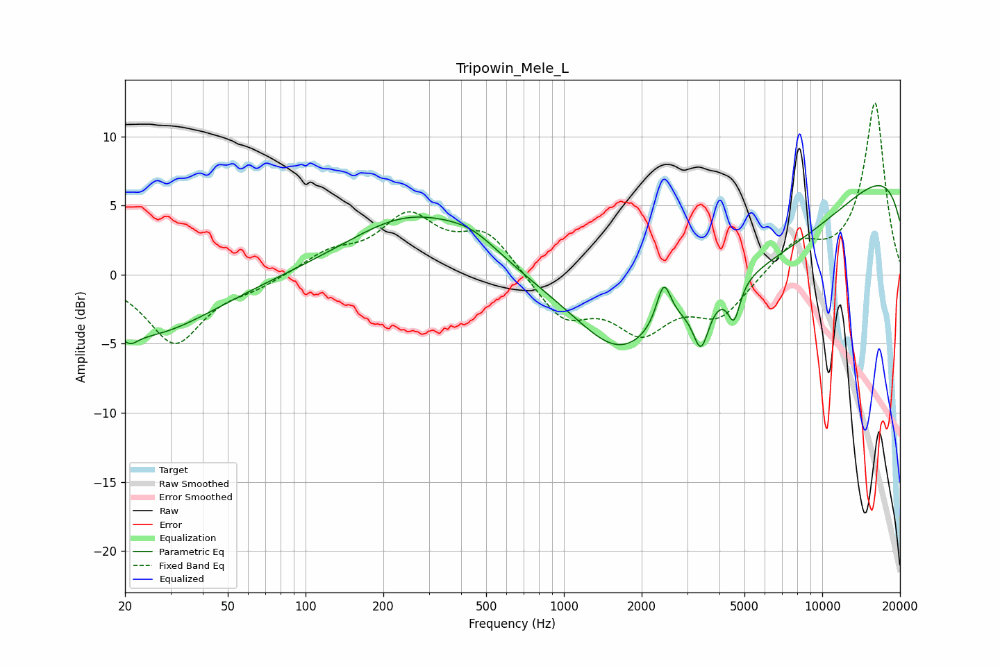

# Tripowin_Mele_L
See [usage instructions](https://github.com/jaakkopasanen/AutoEq#usage) for more options and info.

### Parametric EQs
Apply preamp of -6.5 dB when using parametric equalizer.

|   # | Type    |   Fc (Hz) |    Q |   Gain (dB) |
|-----|---------|-----------|------|-------------|
|   1 | Peaking |        21 | 4.95 |        -0.7 |
|   2 | Peaking |        23 | 0.53 |        -4.4 |
|   3 | Peaking |       256 | 0.58 |         4.2 |
|   4 | Peaking |       443 | 1.29 |         1.2 |
|   5 | Peaking |      1646 | 0.88 |        -4.1 |
|   6 | Peaking |      2436 | 5.04 |         3.1 |
|   7 | Peaking |      3394 | 4.63 |        -3.4 |
|   8 | Peaking |      4555 | 6    |        -2.6 |
|   9 | Peaking |      5488 | 0.25 |       -10.3 |
|  10 | Peaking |     10000 | 0.18 |        12.5 |

### Fixed Band EQs
When using fixed band (also called graphic) equalizer, apply preamp of **-12.5 dB** (if available) and set gains manually with these parameters.

|   # | Type    |   Fc (Hz) |    Q |   Gain (dB) |
|-----|---------|-----------|------|-------------|
|   1 | Peaking |        31 | 1.41 |        -4.9 |
|   2 | Peaking |        62 | 1.41 |        -0.7 |
|   3 | Peaking |       125 | 1.41 |         1.4 |
|   4 | Peaking |       250 | 1.41 |         3.9 |
|   5 | Peaking |       500 | 1.41 |         3   |
|   6 | Peaking |      1000 | 1.41 |        -3.1 |
|   7 | Peaking |      2000 | 1.41 |        -3.7 |
|   8 | Peaking |      4000 | 1.41 |        -2.9 |
|   9 | Peaking |      8000 | 1.41 |         2.2 |
|  10 | Peaking |     16000 | 1.41 |        12.4 |

### Graphs

