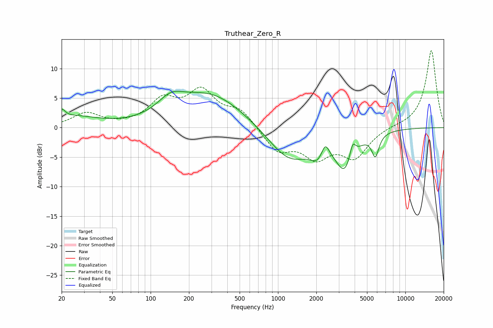

# Truthear_Zero_R
See [usage instructions](https://github.com/jaakkopasanen/AutoEq#usage) for more options and info.

### Parametric EQs
Apply preamp of -6.3 dB when using parametric equalizer.

|   # | Type    |   Fc (Hz) |    Q |   Gain (dB) |
|-----|---------|-----------|------|-------------|
|   1 | Peaking |        20 | 5.34 |         1.5 |
|   2 | Peaking |        25 | 0.74 |         1.7 |
|   3 | Peaking |       144 | 1.4  |         2.6 |
|   4 | Peaking |       296 | 0.53 |         5.7 |
|   5 | Peaking |      1231 | 0.83 |        -5.8 |
|   6 | Peaking |      2049 | 2.55 |        -2.2 |
|   7 | Peaking |      2349 | 4.72 |         2.4 |
|   8 | Peaking |      3358 | 1.9  |        -6.3 |
|   9 | Peaking |      3852 | 6    |         2.8 |
|  10 | Peaking |      5811 | 4.88 |        -3.7 |

### Fixed Band EQs
When using fixed band (also called graphic) equalizer, apply preamp of **-13.1 dB** (if available) and set gains manually with these parameters.

|   # | Type    |   Fc (Hz) |    Q |   Gain (dB) |
|-----|---------|-----------|------|-------------|
|   1 | Peaking |        31 | 1.41 |         2.3 |
|   2 | Peaking |        62 | 1.41 |         0.2 |
|   3 | Peaking |       125 | 1.41 |         4.2 |
|   4 | Peaking |       250 | 1.41 |         5.7 |
|   5 | Peaking |       500 | 1.41 |         2.8 |
|   6 | Peaking |      1000 | 1.41 |        -3.9 |
|   7 | Peaking |      2000 | 1.41 |        -4.5 |
|   8 | Peaking |      4000 | 1.41 |        -4.7 |
|   9 | Peaking |      8000 | 1.41 |         0.2 |
|  10 | Peaking |     16000 | 1.41 |        13.2 |

### Graphs

