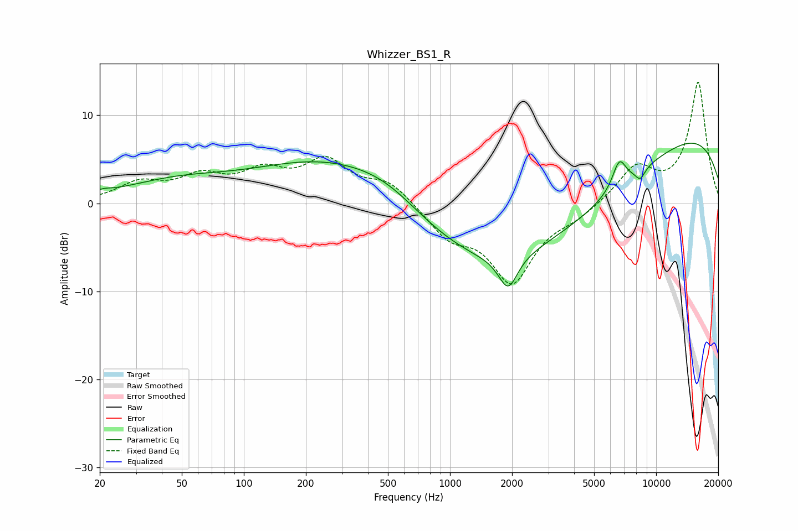

# Whizzer_BS1_R
See [usage instructions](https://github.com/jaakkopasanen/AutoEq#usage) for more options and info.

### Parametric EQs
Apply preamp of -6.9 dB when using parametric equalizer.

|   # | Type    |   Fc (Hz) |    Q |   Gain (dB) |
|-----|---------|-----------|------|-------------|
|   1 | Peaking |        21 | 4.02 |         0.3 |
|   2 | Peaking |        46 | 0.53 |         2.2 |
|   3 | Peaking |       317 | 0.36 |         6.3 |
|   4 | Peaking |       503 | 0.82 |         1.8 |
|   5 | Peaking |      1897 | 4.06 |         0.5 |
|   6 | Peaking |      1912 | 3.16 |        -4.4 |
|   7 | Peaking |      2234 | 0.22 |       -10.8 |
|   8 | Peaking |      6626 | 4.06 |         3.1 |
|   9 | Peaking |      8375 | 5.48 |        -1.2 |
|  10 | Peaking |     10000 | 0.21 |         9.8 |

### Fixed Band EQs
When using fixed band (also called graphic) equalizer, apply preamp of **-13.9 dB** (if available) and set gains manually with these parameters.

|   # | Type    |   Fc (Hz) |    Q |   Gain (dB) |
|-----|---------|-----------|------|-------------|
|   1 | Peaking |        31 | 1.41 |         2.1 |
|   2 | Peaking |        62 | 1.41 |         2.6 |
|   3 | Peaking |       125 | 1.41 |         3   |
|   4 | Peaking |       250 | 1.41 |         4.4 |
|   5 | Peaking |       500 | 1.41 |         2.4 |
|   6 | Peaking |      1000 | 1.41 |        -3.3 |
|   7 | Peaking |      2000 | 1.41 |        -8.6 |
|   8 | Peaking |      4000 | 1.41 |        -1.2 |
|   9 | Peaking |      8000 | 1.41 |         3.9 |
|  10 | Peaking |     16000 | 1.41 |        13.7 |

### Graphs

