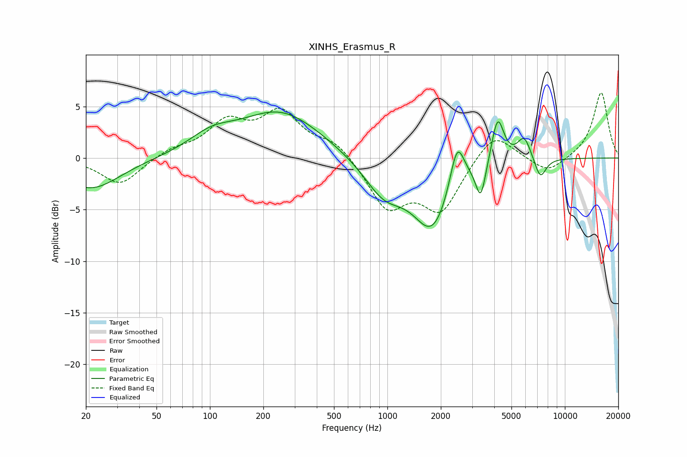

# XINHS_Erasmus_R
See [usage instructions](https://github.com/jaakkopasanen/AutoEq#usage) for more options and info.

### Parametric EQs
Apply preamp of -4.6 dB when using parametric equalizer.

|   # | Type    |   Fc (Hz) |    Q |   Gain (dB) |
|-----|---------|-----------|------|-------------|
|   1 | Peaking |        21 | 0.87 |        -3   |
|   2 | Peaking |       102 | 1.1  |         1.6 |
|   3 | Peaking |       250 | 0.62 |         4.4 |
|   4 | Peaking |       956 | 1.23 |        -3.3 |
|   5 | Peaking |      1797 | 1.3  |        -6.6 |
|   6 | Peaking |      2471 | 3.47 |         4.6 |
|   7 | Peaking |      3358 | 5.05 |        -3.5 |
|   8 | Peaking |      4180 | 4.03 |         4.6 |
|   9 | Peaking |      5897 | 3.58 |         2.2 |
|  10 | Peaking |      7268 | 4.12 |        -2.1 |

### Fixed Band EQs
When using fixed band (also called graphic) equalizer, apply preamp of **-6.4 dB** (if available) and set gains manually with these parameters.

|   # | Type    |   Fc (Hz) |    Q |   Gain (dB) |
|-----|---------|-----------|------|-------------|
|   1 | Peaking |        31 | 1.41 |        -2.6 |
|   2 | Peaking |        62 | 1.41 |         0.8 |
|   3 | Peaking |       125 | 1.41 |         3.2 |
|   4 | Peaking |       250 | 1.41 |         4.1 |
|   5 | Peaking |       500 | 1.41 |         1.6 |
|   6 | Peaking |      1000 | 1.41 |        -4.7 |
|   7 | Peaking |      2000 | 1.41 |        -4.9 |
|   8 | Peaking |      4000 | 1.41 |         2.8 |
|   9 | Peaking |      8000 | 1.41 |        -1.5 |
|  10 | Peaking |     16000 | 1.41 |         6.4 |

### Graphs

