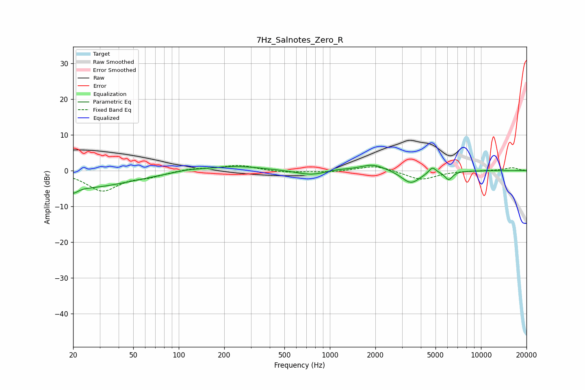

# 7Hz_Salnotes_Zero_R
See [usage instructions](https://github.com/jaakkopasanen/AutoEq#usage) for more options and info.

### Parametric EQs
Apply preamp of -1.6 dB when using parametric equalizer.

|   # | Type    |   Fc (Hz) |    Q |   Gain (dB) |
|-----|---------|-----------|------|-------------|
|   1 | Peaking |        20 | 4.72 |        -1.7 |
|   2 | Peaking |        23 | 0.45 |        -4.7 |
|   3 | Peaking |       114 | 1.58 |         0.5 |
|   4 | Peaking |       234 | 0.79 |         1.3 |
|   5 | Peaking |       759 | 1.4  |        -1.4 |
|   6 | Peaking |      1095 | 1.78 |         0.5 |
|   7 | Peaking |      1928 | 1.7  |         1.9 |
|   8 | Peaking |      3431 | 2.29 |        -3.7 |
|   9 | Peaking |      4769 | 5.96 |         1.8 |
|  10 | Peaking |      6112 | 5.35 |        -2.4 |

### Fixed Band EQs
When using fixed band (also called graphic) equalizer, apply preamp of **-1.5 dB** (if available) and set gains manually with these parameters.

|   # | Type    |   Fc (Hz) |    Q |   Gain (dB) |
|-----|---------|-----------|------|-------------|
|   1 | Peaking |        31 | 1.41 |        -5.5 |
|   2 | Peaking |        62 | 1.41 |        -1.3 |
|   3 | Peaking |       125 | 1.41 |         0.6 |
|   4 | Peaking |       250 | 1.41 |         1.5 |
|   5 | Peaking |       500 | 1.41 |        -0.6 |
|   6 | Peaking |      1000 | 1.41 |        -0.4 |
|   7 | Peaking |      2000 | 1.41 |         1.5 |
|   8 | Peaking |      4000 | 1.41 |        -2.6 |
|   9 | Peaking |      8000 | 1.41 |         0   |
|  10 | Peaking |     16000 | 1.41 |         0.8 |

### Graphs

