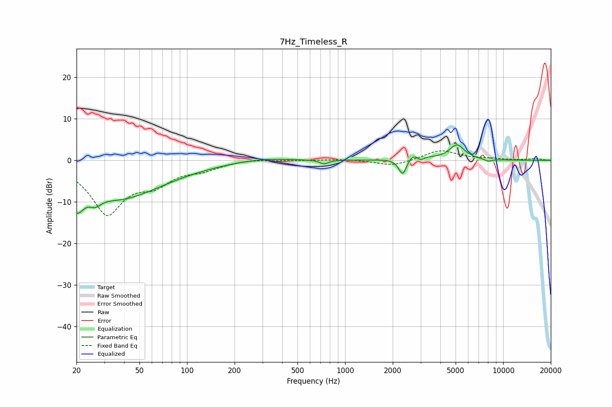

# 7Hz_Timeless_R
See [usage instructions](https://github.com/jaakkopasanen/AutoEq#usage) for more options and info.

### Parametric EQs
Apply preamp of -3.8 dB when using parametric equalizer.

|   # | Type    |   Fc (Hz) |    Q |   Gain (dB) |
|-----|---------|-----------|------|-------------|
|   1 | Peaking |        20 | 3.09 |        -6.2 |
|   2 | Peaking |        26 | 4.05 |        -1.9 |
|   3 | Peaking |        37 | 0.49 |        -9   |
|   4 | Peaking |       298 | 0.82 |         0.8 |
|   5 | Peaking |       735 | 5.34 |        -1   |
|   6 | Peaking |      2320 | 5.32 |        -4.6 |
|   7 | Peaking |      2698 | 2.37 |         2.3 |
|   8 | Peaking |      2998 | 5.85 |        -1.4 |
|   9 | Peaking |      5097 | 2.87 |         3.6 |
|  10 | Peaking |      8049 | 5.81 |        -0.5 |

### Fixed Band EQs
When using fixed band (also called graphic) equalizer, apply preamp of **-2.4 dB** (if available) and set gains manually with these parameters.

|   # | Type    |   Fc (Hz) |    Q |   Gain (dB) |
|-----|---------|-----------|------|-------------|
|   1 | Peaking |        31 | 1.41 |       -12.5 |
|   2 | Peaking |        62 | 1.41 |        -4.3 |
|   3 | Peaking |       125 | 1.41 |        -1.7 |
|   4 | Peaking |       250 | 1.41 |         0.4 |
|   5 | Peaking |       500 | 1.41 |         0   |
|   6 | Peaking |      1000 | 1.41 |         0.3 |
|   7 | Peaking |      2000 | 1.41 |        -1.4 |
|   8 | Peaking |      4000 | 1.41 |         2.5 |
|   9 | Peaking |      8000 | 1.41 |         0.3 |
|  10 | Peaking |     16000 | 1.41 |         0.4 |

### Graphs

