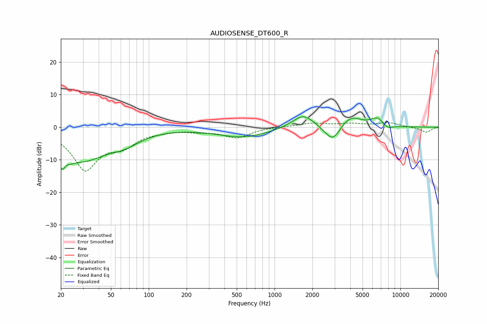

# AUDIOSENSE_DT600_R
See [usage instructions](https://github.com/jaakkopasanen/AutoEq#usage) for more options and info.

### Parametric EQs
Apply preamp of -3.3 dB when using parametric equalizer.

|   # | Type    |   Fc (Hz) |    Q |   Gain (dB) |
|-----|---------|-----------|------|-------------|
|   1 | Peaking |        21 | 3.51 |        -8.4 |
|   2 | Peaking |        22 | 5.69 |         3.3 |
|   3 | Peaking |        30 | 0.7  |        -9.1 |
|   4 | Peaking |        64 | 1.13 |        -2.8 |
|   5 | Peaking |       561 | 0.69 |        -3.1 |
|   6 | Peaking |      1692 | 1.6  |         4.3 |
|   7 | Peaking |      2893 | 2.15 |        -5.6 |
|   8 | Peaking |      3981 | 1.63 |         3.8 |
|   9 | Peaking |      6602 | 2.61 |         2.7 |
|  10 | Peaking |      7845 | 3.13 |        -1.4 |

### Fixed Band EQs
When using fixed band (also called graphic) equalizer, apply preamp of **-1.5 dB** (if available) and set gains manually with these parameters.

|   # | Type    |   Fc (Hz) |    Q |   Gain (dB) |
|-----|---------|-----------|------|-------------|
|   1 | Peaking |        31 | 1.41 |       -12.6 |
|   2 | Peaking |        62 | 1.41 |        -4.4 |
|   3 | Peaking |       125 | 1.41 |        -0.7 |
|   4 | Peaking |       250 | 1.41 |        -0.9 |
|   5 | Peaking |       500 | 1.41 |        -3.1 |
|   6 | Peaking |      1000 | 1.41 |         0.1 |
|   7 | Peaking |      2000 | 1.41 |         1.2 |
|   8 | Peaking |      4000 | 1.41 |         0.9 |
|   9 | Peaking |      8000 | 1.41 |         1.3 |
|  10 | Peaking |     16000 | 1.41 |        -1.6 |

### Graphs

