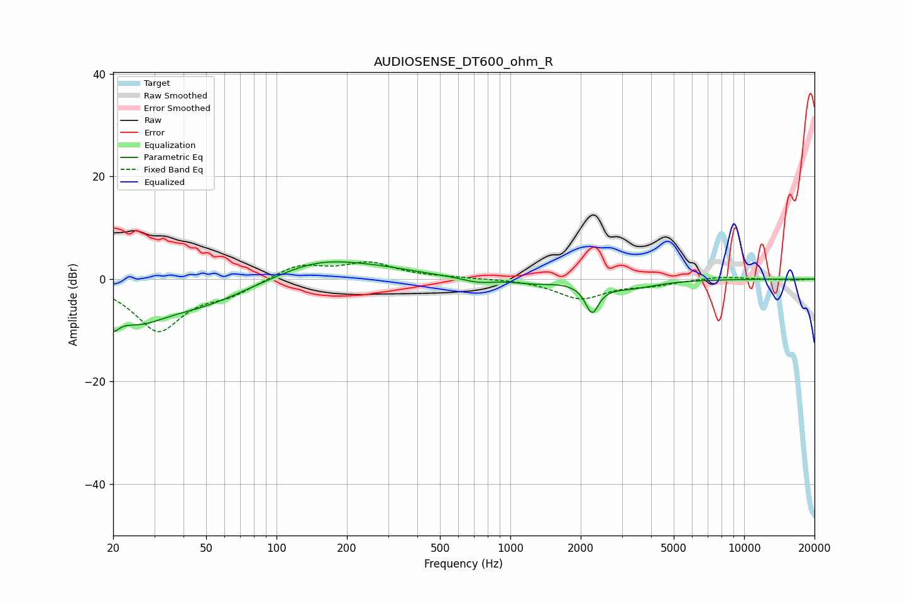

# AUDIOSENSE_DT600_ohm_R
See [usage instructions](https://github.com/jaakkopasanen/AutoEq#usage) for more options and info.

### Parametric EQs
Apply preamp of -3.4 dB when using parametric equalizer.

|   # | Type    |   Fc (Hz) |    Q |   Gain (dB) |
|-----|---------|-----------|------|-------------|
|   1 | Peaking |        20 | 4.43 |        -8.3 |
|   2 | Peaking |        20 | 4.04 |         4.5 |
|   3 | Peaking |        25 | 1.09 |        -6.3 |
|   4 | Peaking |        48 | 0.7  |        -4.1 |
|   5 | Peaking |       150 | 0.77 |         3.5 |
|   6 | Peaking |       279 | 0.79 |         1.3 |
|   7 | Peaking |       732 | 2.11 |        -0.9 |
|   8 | Peaking |      1259 | 1.75 |        -0.7 |
|   9 | Peaking |      2237 | 4.87 |        -5.6 |
|  10 | Peaking |      3200 | 1.23 |        -1.6 |

### Fixed Band EQs
When using fixed band (also called graphic) equalizer, apply preamp of **-3.4 dB** (if available) and set gains manually with these parameters.

|   # | Type    |   Fc (Hz) |    Q |   Gain (dB) |
|-----|---------|-----------|------|-------------|
|   1 | Peaking |        31 | 1.41 |       -10   |
|   2 | Peaking |        62 | 1.41 |        -2.4 |
|   3 | Peaking |       125 | 1.41 |         2.9 |
|   4 | Peaking |       250 | 1.41 |         3   |
|   5 | Peaking |       500 | 1.41 |         0.2 |
|   6 | Peaking |      1000 | 1.41 |         0.1 |
|   7 | Peaking |      2000 | 1.41 |        -3.8 |
|   8 | Peaking |      4000 | 1.41 |        -1   |
|   9 | Peaking |      8000 | 1.41 |         0.5 |
|  10 | Peaking |     16000 | 1.41 |        -0.2 |

### Graphs

