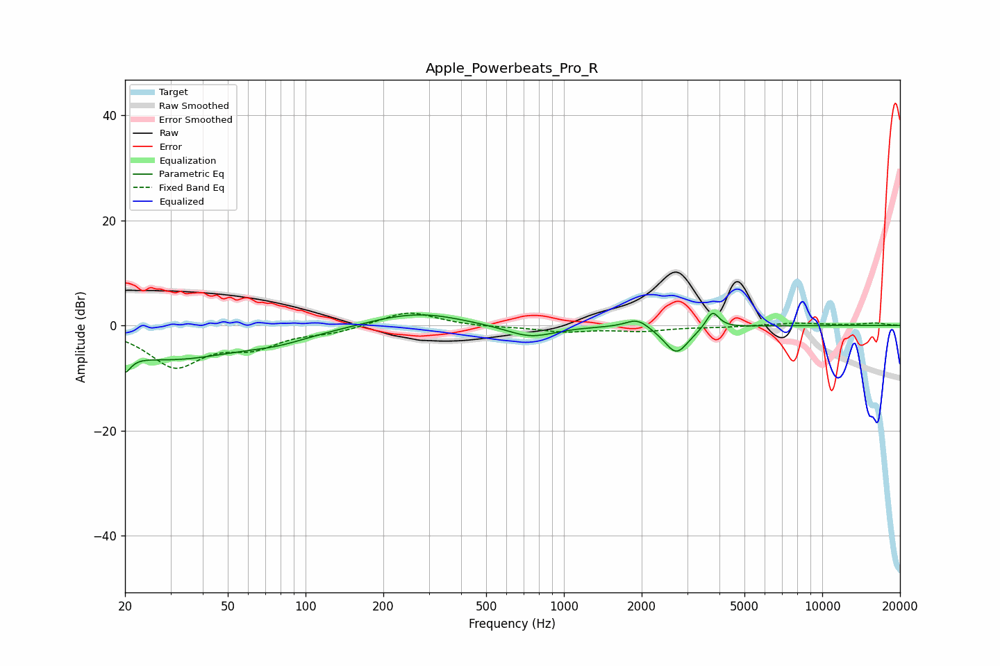

# Apple_Powerbeats_Pro_R
See [usage instructions](https://github.com/jaakkopasanen/AutoEq#usage) for more options and info.

### Parametric EQs
Apply preamp of -2.4 dB when using parametric equalizer.

|   # | Type    |   Fc (Hz) |    Q |   Gain (dB) |
|-----|---------|-----------|------|-------------|
|   1 | Peaking |        20 | 5.88 |        -6.9 |
|   2 | Peaking |        20 | 5.71 |         3.4 |
|   3 | Peaking |        30 | 0.5  |        -6.2 |
|   4 | Peaking |        78 | 1.12 |        -1.4 |
|   5 | Peaking |       215 | 1.09 |         0.8 |
|   6 | Peaking |       296 | 0.93 |         2   |
|   7 | Peaking |       743 | 1.49 |        -2.3 |
|   8 | Peaking |      1926 | 3.18 |         1.8 |
|   9 | Peaking |      2726 | 2.96 |        -5.3 |
|  10 | Peaking |      3761 | 5.73 |         3.3 |

### Fixed Band EQs
When using fixed band (also called graphic) equalizer, apply preamp of **-2.4 dB** (if available) and set gains manually with these parameters.

|   # | Type    |   Fc (Hz) |    Q |   Gain (dB) |
|-----|---------|-----------|------|-------------|
|   1 | Peaking |        31 | 1.41 |        -7.5 |
|   2 | Peaking |        62 | 1.41 |        -3.4 |
|   3 | Peaking |       125 | 1.41 |        -1.1 |
|   4 | Peaking |       250 | 1.41 |         2.8 |
|   5 | Peaking |       500 | 1.41 |        -0.3 |
|   6 | Peaking |      1000 | 1.41 |        -1.1 |
|   7 | Peaking |      2000 | 1.41 |        -1   |
|   8 | Peaking |      4000 | 1.41 |        -0.3 |
|   9 | Peaking |      8000 | 1.41 |         0.5 |
|  10 | Peaking |     16000 | 1.41 |         0.5 |

### Graphs

