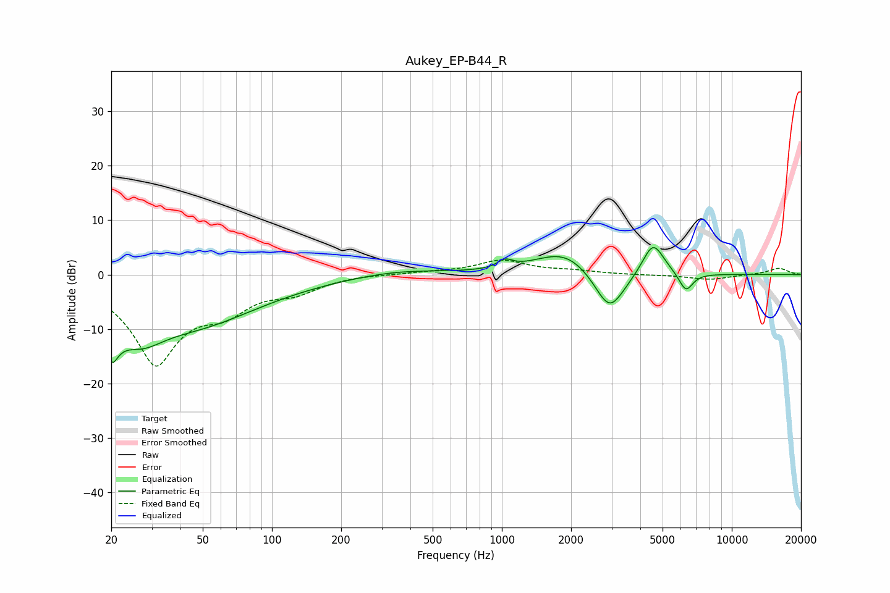

# Aukey_EP-B44_R
See [usage instructions](https://github.com/jaakkopasanen/AutoEq#usage) for more options and info.

### Parametric EQs
Apply preamp of -5.1 dB when using parametric equalizer.

|   # | Type    |   Fc (Hz) |    Q |   Gain (dB) |
|-----|---------|-----------|------|-------------|
|   1 | Peaking |        20 | 4.58 |         4.2 |
|   2 | Peaking |        20 | 4.2  |       -12.1 |
|   3 | Peaking |        27 | 1.3  |        -6.2 |
|   4 | Peaking |        48 | 0.49 |        -8.3 |
|   5 | Peaking |       354 | 0.76 |         1   |
|   6 | Peaking |      1032 | 4.44 |         1.5 |
|   7 | Peaking |      1899 | 1.07 |         4.7 |
|   8 | Peaking |      2939 | 2.02 |        -8.4 |
|   9 | Peaking |      4547 | 2.88 |         6.3 |
|  10 | Peaking |      6313 | 4.46 |        -3.5 |

### Fixed Band EQs
When using fixed band (also called graphic) equalizer, apply preamp of **-2.8 dB** (if available) and set gains manually with these parameters.

|   # | Type    |   Fc (Hz) |    Q |   Gain (dB) |
|-----|---------|-----------|------|-------------|
|   1 | Peaking |        31 | 1.41 |       -15.9 |
|   2 | Peaking |        62 | 1.41 |        -4.6 |
|   3 | Peaking |       125 | 1.41 |        -2.5 |
|   4 | Peaking |       250 | 1.41 |         0.1 |
|   5 | Peaking |       500 | 1.41 |         0.4 |
|   6 | Peaking |      1000 | 1.41 |         2.5 |
|   7 | Peaking |      2000 | 1.41 |         0.6 |
|   8 | Peaking |      4000 | 1.41 |        -0.1 |
|   9 | Peaking |      8000 | 1.41 |        -0.9 |
|  10 | Peaking |     16000 | 1.41 |         1.2 |

### Graphs

