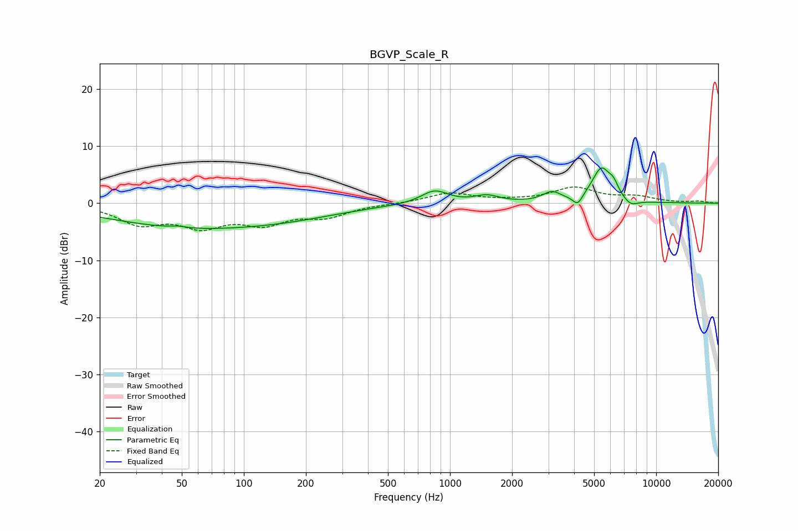

# BGVP_Scale_R
See [usage instructions](https://github.com/jaakkopasanen/AutoEq#usage) for more options and info.

### Parametric EQs
Apply preamp of -6.3 dB when using parametric equalizer.

|   # | Type    |   Fc (Hz) |    Q |   Gain (dB) |
|-----|---------|-----------|------|-------------|
|   1 | Peaking |        48 | 4.33 |         0.3 |
|   2 | Peaking |        54 | 0.35 |        -4   |
|   3 | Peaking |       179 | 0.54 |        -1.3 |
|   4 | Peaking |       842 | 2.17 |         2.3 |
|   5 | Peaking |      1509 | 2.39 |         1.2 |
|   6 | Peaking |      3117 | 3.22 |         1.7 |
|   7 | Peaking |      4162 | 6    |        -1.8 |
|   8 | Peaking |      5425 | 2.98 |         5.9 |
|   9 | Peaking |      6216 | 5.99 |         1.6 |
|  10 | Peaking |      7523 | 3.76 |        -1.2 |

### Fixed Band EQs
When using fixed band (also called graphic) equalizer, apply preamp of **-2.9 dB** (if available) and set gains manually with these parameters.

|   # | Type    |   Fc (Hz) |    Q |   Gain (dB) |
|-----|---------|-----------|------|-------------|
|   1 | Peaking |        31 | 1.41 |        -3.3 |
|   2 | Peaking |        62 | 1.41 |        -3.6 |
|   3 | Peaking |       125 | 1.41 |        -3.1 |
|   4 | Peaking |       250 | 1.41 |        -2.1 |
|   5 | Peaking |       500 | 1.41 |        -0.1 |
|   6 | Peaking |      1000 | 1.41 |         1.8 |
|   7 | Peaking |      2000 | 1.41 |         0.3 |
|   8 | Peaking |      4000 | 1.41 |         2.6 |
|   9 | Peaking |      8000 | 1.41 |         1   |
|  10 | Peaking |     16000 | 1.41 |         0.3 |

### Graphs

