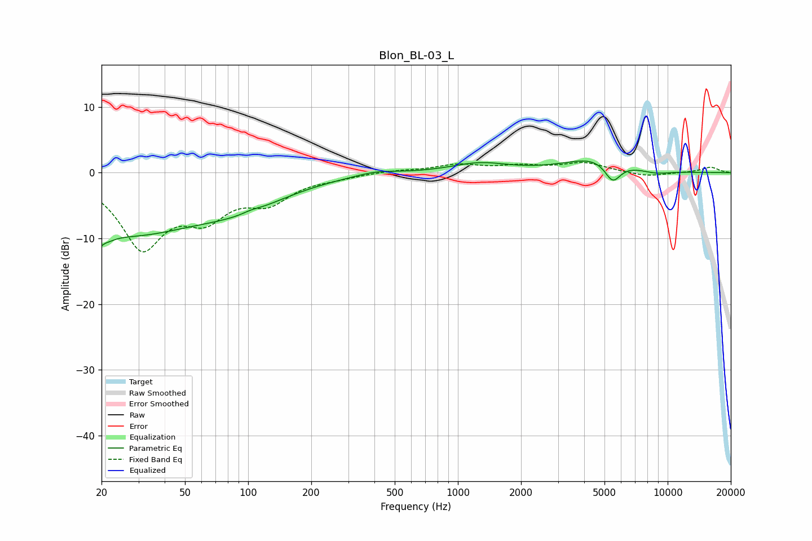

# Blon_BL-03_L
See [usage instructions](https://github.com/jaakkopasanen/AutoEq#usage) for more options and info.

### Parametric EQs
Apply preamp of -1.9 dB when using parametric equalizer.

|   # | Type    |   Fc (Hz) |    Q |   Gain (dB) |
|-----|---------|-----------|------|-------------|
|   1 | Peaking |        20 | 4.25 |        -6.2 |
|   2 | Peaking |        20 | 5.44 |         3.5 |
|   3 | Peaking |        27 | 0.42 |        -8.6 |
|   4 | Peaking |        94 | 0.63 |        -3.3 |
|   5 | Peaking |       103 | 3.57 |         0.3 |
|   6 | Peaking |       405 | 1.55 |         0.6 |
|   7 | Peaking |      1270 | 1.06 |         1.4 |
|   8 | Peaking |      4582 | 0.96 |         2.3 |
|   9 | Peaking |      5467 | 3.57 |        -3.1 |
|  10 | Peaking |      8744 | 1.8  |        -0.5 |

### Fixed Band EQs
When using fixed band (also called graphic) equalizer, apply preamp of **-1.7 dB** (if available) and set gains manually with these parameters.

|   # | Type    |   Fc (Hz) |    Q |   Gain (dB) |
|-----|---------|-----------|------|-------------|
|   1 | Peaking |        31 | 1.41 |       -10.9 |
|   2 | Peaking |        62 | 1.41 |        -5.4 |
|   3 | Peaking |       125 | 1.41 |        -3.8 |
|   4 | Peaking |       250 | 1.41 |        -0.5 |
|   5 | Peaking |       500 | 1.41 |         0.3 |
|   6 | Peaking |      1000 | 1.41 |         1.1 |
|   7 | Peaking |      2000 | 1.41 |         0.9 |
|   8 | Peaking |      4000 | 1.41 |         1.4 |
|   9 | Peaking |      8000 | 1.41 |        -0.6 |
|  10 | Peaking |     16000 | 1.41 |         0.8 |

### Graphs

