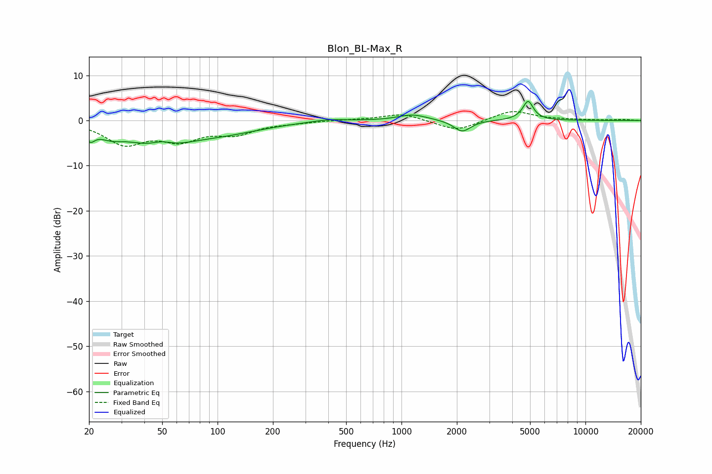

# Blon_BL-Max_R
See [usage instructions](https://github.com/jaakkopasanen/AutoEq#usage) for more options and info.

### Parametric EQs
Apply preamp of -4.3 dB when using parametric equalizer.

|   # | Type    |   Fc (Hz) |    Q |   Gain (dB) |
|-----|---------|-----------|------|-------------|
|   1 | Peaking |        20 | 5.69 |        -2.4 |
|   2 | Peaking |        26 | 2.13 |        -1.7 |
|   3 | Peaking |        48 | 0.8  |        -5.2 |
|   4 | Peaking |        50 | 2.52 |         1.4 |
|   5 | Peaking |       114 | 0.67 |        -1.9 |
|   6 | Peaking |       400 | 1.61 |         0.5 |
|   7 | Peaking |      1150 | 1.8  |         1.3 |
|   8 | Peaking |      2139 | 3.12 |        -2.6 |
|   9 | Peaking |      4787 | 2.95 |         0.9 |
|  10 | Peaking |      4884 | 5.47 |         3.4 |

### Fixed Band EQs
When using fixed band (also called graphic) equalizer, apply preamp of **-2.0 dB** (if available) and set gains manually with these parameters.

|   # | Type    |   Fc (Hz) |    Q |   Gain (dB) |
|-----|---------|-----------|------|-------------|
|   1 | Peaking |        31 | 1.41 |        -4.9 |
|   2 | Peaking |        62 | 1.41 |        -3.8 |
|   3 | Peaking |       125 | 1.41 |        -2.6 |
|   4 | Peaking |       250 | 1.41 |        -0.4 |
|   5 | Peaking |       500 | 1.41 |         0.1 |
|   6 | Peaking |      1000 | 1.41 |         1.6 |
|   7 | Peaking |      2000 | 1.41 |        -2.4 |
|   8 | Peaking |      4000 | 1.41 |         2.3 |
|   9 | Peaking |      8000 | 1.41 |         0.1 |
|  10 | Peaking |     16000 | 1.41 |         0.2 |

### Graphs

