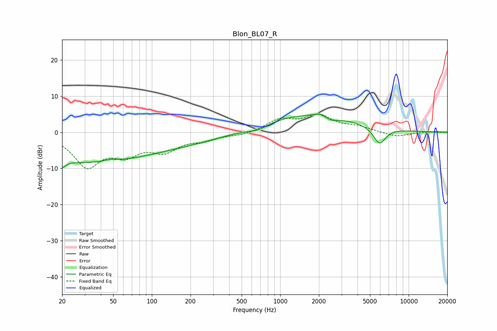

# Blon_BL07_R
See [usage instructions](https://github.com/jaakkopasanen/AutoEq#usage) for more options and info.

### Parametric EQs
Apply preamp of -5.1 dB when using parametric equalizer.

|   # | Type    |   Fc (Hz) |    Q |   Gain (dB) |
|-----|---------|-----------|------|-------------|
|   1 | Peaking |        20 | 6    |         6.2 |
|   2 | Peaking |        20 | 5.84 |        -8.3 |
|   3 | Peaking |        27 | 0.3  |        -7.5 |
|   4 | Peaking |        47 | 2.65 |         0.6 |
|   5 | Peaking |       172 | 0.3  |        -3   |
|   6 | Peaking |       667 | 1.57 |        -1.6 |
|   7 | Peaking |      1483 | 0.33 |         5.2 |
|   8 | Peaking |      2027 | 3.37 |         0.9 |
|   9 | Peaking |      2511 | 2.67 |        -1   |
|  10 | Peaking |      5929 | 2.84 |        -4.8 |

### Fixed Band EQs
When using fixed band (also called graphic) equalizer, apply preamp of **-5.1 dB** (if available) and set gains manually with these parameters.

|   # | Type    |   Fc (Hz) |    Q |   Gain (dB) |
|-----|---------|-----------|------|-------------|
|   1 | Peaking |        31 | 1.41 |        -9   |
|   2 | Peaking |        62 | 1.41 |        -4.9 |
|   3 | Peaking |       125 | 1.41 |        -4.5 |
|   4 | Peaking |       250 | 1.41 |        -1.7 |
|   5 | Peaking |       500 | 1.41 |        -0.8 |
|   6 | Peaking |      1000 | 1.41 |         3.3 |
|   7 | Peaking |      2000 | 1.41 |         4.3 |
|   8 | Peaking |      4000 | 1.41 |         1.3 |
|   9 | Peaking |      8000 | 1.41 |        -1.3 |
|  10 | Peaking |     16000 | 1.41 |         0.2 |

### Graphs

