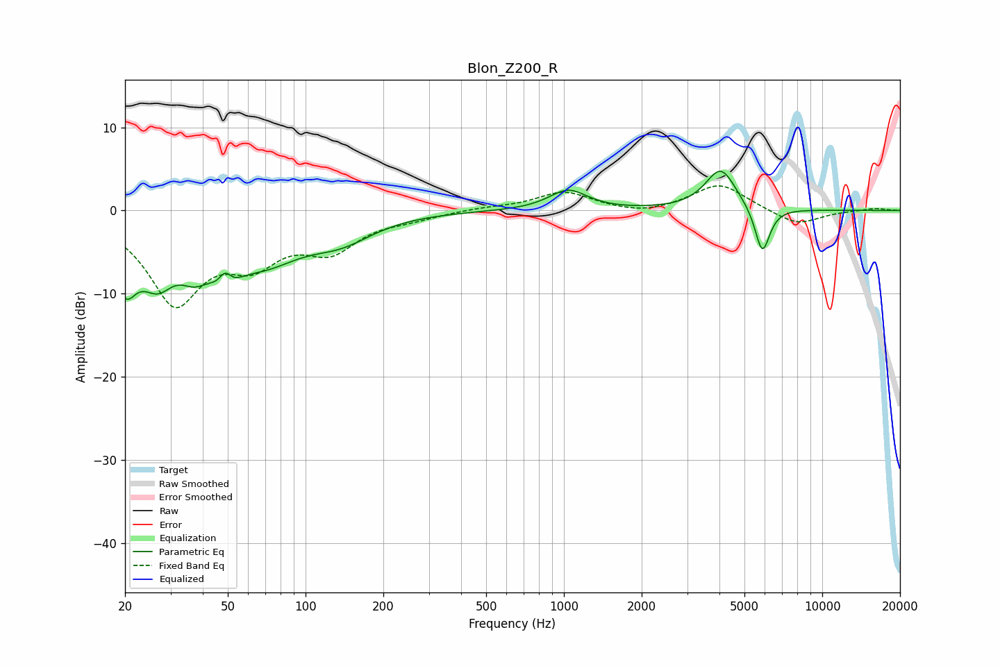

# Blon_Z200_R
See [usage instructions](https://github.com/jaakkopasanen/AutoEq#usage) for more options and info.

### Parametric EQs
Apply preamp of -4.8 dB when using parametric equalizer.

|   # | Type    |   Fc (Hz) |    Q |   Gain (dB) |
|-----|---------|-----------|------|-------------|
|   1 | Peaking |        20 | 3.11 |        -7   |
|   2 | Peaking |        27 | 2.03 |        -6   |
|   3 | Peaking |        37 | 2.42 |        -3.4 |
|   4 | Peaking |        49 | 2.98 |        -5.2 |
|   5 | Peaking |        49 | 5.11 |         3.8 |
|   6 | Peaking |        69 | 0.94 |        -5.2 |
|   7 | Peaking |       137 | 1.11 |        -2.6 |
|   8 | Peaking |      1039 | 1.92 |         2.4 |
|   9 | Peaking |      4049 | 2.34 |         5   |
|  10 | Peaking |      5865 | 4.75 |        -5.7 |

### Fixed Band EQs
When using fixed band (also called graphic) equalizer, apply preamp of **-3.1 dB** (if available) and set gains manually with these parameters.

|   # | Type    |   Fc (Hz) |    Q |   Gain (dB) |
|-----|---------|-----------|------|-------------|
|   1 | Peaking |        31 | 1.41 |       -10.6 |
|   2 | Peaking |        62 | 1.41 |        -4.8 |
|   3 | Peaking |       125 | 1.41 |        -4.1 |
|   4 | Peaking |       250 | 1.41 |        -0.7 |
|   5 | Peaking |       500 | 1.41 |         0.3 |
|   6 | Peaking |      1000 | 1.41 |         2.2 |
|   7 | Peaking |      2000 | 1.41 |        -0.6 |
|   8 | Peaking |      4000 | 1.41 |         3.2 |
|   9 | Peaking |      8000 | 1.41 |        -1.8 |
|  10 | Peaking |     16000 | 1.41 |         0.3 |

### Graphs

