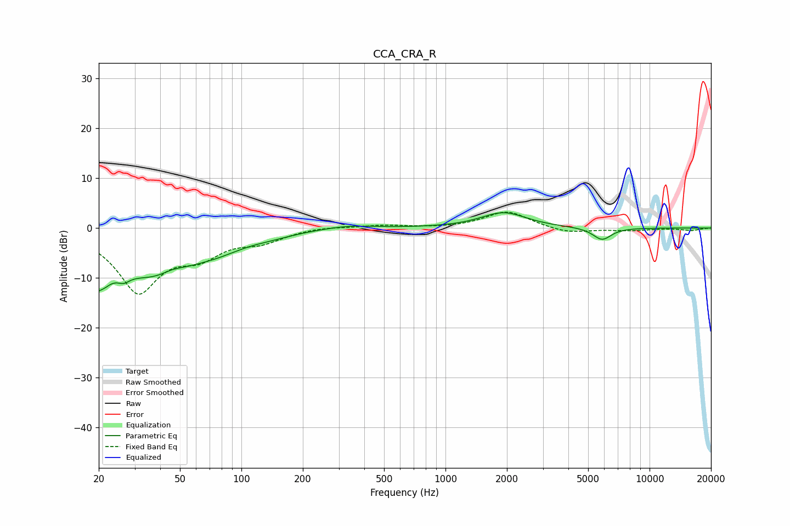

# CCA_CRA_R
See [usage instructions](https://github.com/jaakkopasanen/AutoEq#usage) for more options and info.

### Parametric EQs
Apply preamp of -3.2 dB when using parametric equalizer.

|   # | Type    |   Fc (Hz) |    Q |   Gain (dB) |
|-----|---------|-----------|------|-------------|
|   1 | Peaking |        20 | 3.36 |       -10.4 |
|   2 | Peaking |        20 | 5.54 |         3.3 |
|   3 | Peaking |        26 | 4.65 |        -1.5 |
|   4 | Peaking |        36 | 0.66 |        -8.8 |
|   5 | Peaking |        46 | 2.94 |         0.7 |
|   6 | Peaking |        76 | 1.09 |        -1.7 |
|   7 | Peaking |       141 | 1.27 |        -0.6 |
|   8 | Peaking |       335 | 1.13 |         0.7 |
|   9 | Peaking |      1927 | 1.28 |         3.1 |
|  10 | Peaking |      5851 | 3.03 |        -2.5 |

### Fixed Band EQs
When using fixed band (also called graphic) equalizer, apply preamp of **-3.3 dB** (if available) and set gains manually with these parameters.

|   # | Type    |   Fc (Hz) |    Q |   Gain (dB) |
|-----|---------|-----------|------|-------------|
|   1 | Peaking |        31 | 1.41 |       -12.4 |
|   2 | Peaking |        62 | 1.41 |        -4.3 |
|   3 | Peaking |       125 | 1.41 |        -2.3 |
|   4 | Peaking |       250 | 1.41 |         0.4 |
|   5 | Peaking |       500 | 1.41 |         0.5 |
|   6 | Peaking |      1000 | 1.41 |        -0.1 |
|   7 | Peaking |      2000 | 1.41 |         3.4 |
|   8 | Peaking |      4000 | 1.41 |        -1.1 |
|   9 | Peaking |      8000 | 1.41 |        -0.5 |
|  10 | Peaking |     16000 | 1.41 |        -0.5 |

### Graphs

