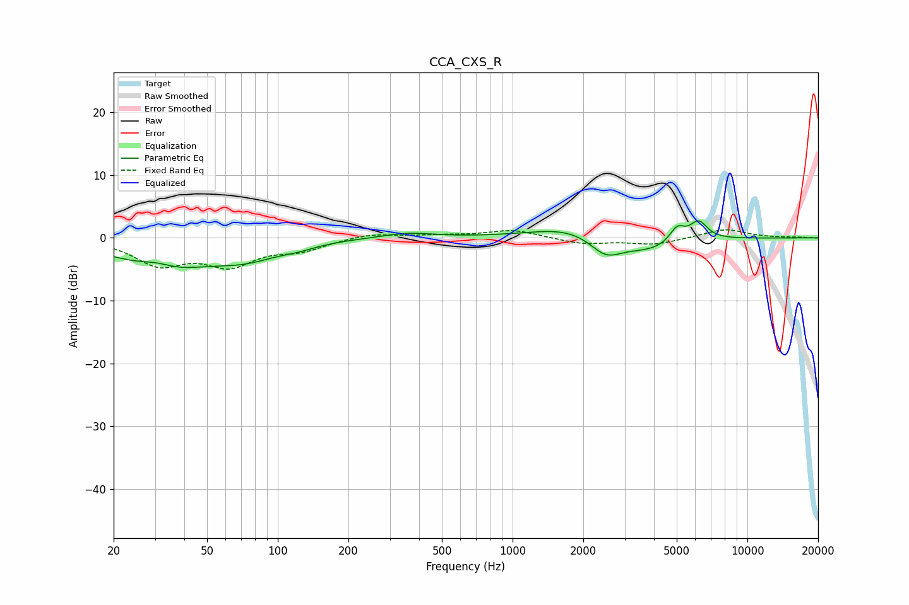

# CCA_CXS_R
See [usage instructions](https://github.com/jaakkopasanen/AutoEq#usage) for more options and info.

### Parametric EQs
Apply preamp of -2.8 dB when using parametric equalizer.

|   # | Type    |   Fc (Hz) |    Q |   Gain (dB) |
|-----|---------|-----------|------|-------------|
|   1 | Peaking |        30 | 1.93 |         1.3 |
|   2 | Peaking |        32 | 0.73 |        -4.8 |
|   3 | Peaking |        74 | 1    |        -2.4 |
|   4 | Peaking |       123 | 1.81 |        -0.6 |
|   5 | Peaking |       357 | 1.26 |         0.8 |
|   6 | Peaking |      1783 | 0.85 |         1.9 |
|   7 | Peaking |      2492 | 2.03 |        -3.1 |
|   8 | Peaking |      3768 | 1.13 |        -2.1 |
|   9 | Peaking |      5023 | 4.37 |         2.4 |
|  10 | Peaking |      6190 | 3.61 |         3   |

### Fixed Band EQs
When using fixed band (also called graphic) equalizer, apply preamp of **-1.4 dB** (if available) and set gains manually with these parameters.

|   # | Type    |   Fc (Hz) |    Q |   Gain (dB) |
|-----|---------|-----------|------|-------------|
|   1 | Peaking |        31 | 1.41 |        -4   |
|   2 | Peaking |        62 | 1.41 |        -4   |
|   3 | Peaking |       125 | 1.41 |        -1.7 |
|   4 | Peaking |       250 | 1.41 |         0.8 |
|   5 | Peaking |       500 | 1.41 |         0.3 |
|   6 | Peaking |      1000 | 1.41 |         1.3 |
|   7 | Peaking |      2000 | 1.41 |        -1   |
|   8 | Peaking |      4000 | 1.41 |        -1   |
|   9 | Peaking |      8000 | 1.41 |         1.4 |
|  10 | Peaking |     16000 | 1.41 |         0.1 |

### Graphs

