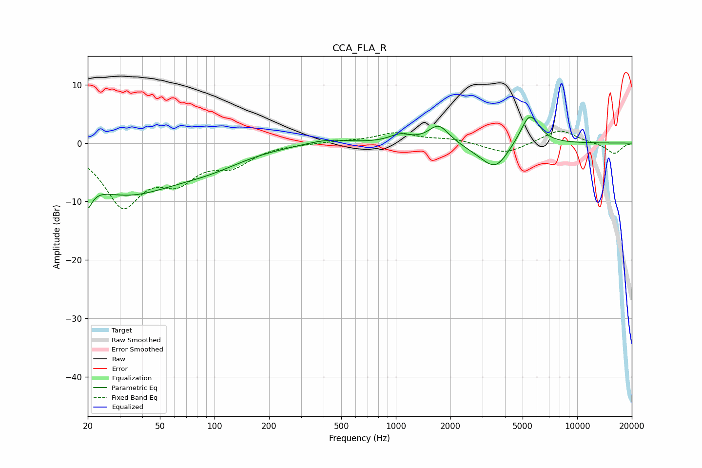

# CCA_FLA_R
See [usage instructions](https://github.com/jaakkopasanen/AutoEq#usage) for more options and info.

### Parametric EQs
Apply preamp of -4.6 dB when using parametric equalizer.

|   # | Type    |   Fc (Hz) |    Q |   Gain (dB) |
|-----|---------|-----------|------|-------------|
|   1 | Peaking |        20 | 5.64 |        -9.2 |
|   2 | Peaking |        20 | 5.94 |         4.9 |
|   3 | Peaking |        32 | 0.47 |        -8.3 |
|   4 | Peaking |        95 | 0.73 |        -2.1 |
|   5 | Peaking |       416 | 1.27 |         0.8 |
|   6 | Peaking |      1055 | 2.43 |         1.3 |
|   7 | Peaking |      1724 | 2.5  |         3.2 |
|   8 | Peaking |      3084 | 1.43 |        -1.3 |
|   9 | Peaking |      3573 | 2.03 |        -3.5 |
|  10 | Peaking |      5473 | 2.64 |         5.4 |

### Fixed Band EQs
When using fixed band (also called graphic) equalizer, apply preamp of **-2.1 dB** (if available) and set gains manually with these parameters.

|   # | Type    |   Fc (Hz) |    Q |   Gain (dB) |
|-----|---------|-----------|------|-------------|
|   1 | Peaking |        31 | 1.41 |       -10.2 |
|   2 | Peaking |        62 | 1.41 |        -5.1 |
|   3 | Peaking |       125 | 1.41 |        -3.2 |
|   4 | Peaking |       250 | 1.41 |        -0   |
|   5 | Peaking |       500 | 1.41 |         0.3 |
|   6 | Peaking |      1000 | 1.41 |         1.7 |
|   7 | Peaking |      2000 | 1.41 |         0.7 |
|   8 | Peaking |      4000 | 1.41 |        -1.9 |
|   9 | Peaking |      8000 | 1.41 |         2.4 |
|  10 | Peaking |     16000 | 1.41 |        -1.8 |

### Graphs

