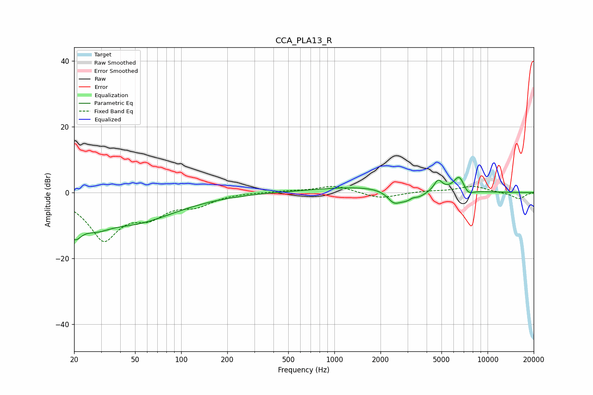

# CCA_PLA13_R
See [usage instructions](https://github.com/jaakkopasanen/AutoEq#usage) for more options and info.

### Parametric EQs
Apply preamp of -4.7 dB when using parametric equalizer.

|   # | Type    |   Fc (Hz) |    Q |   Gain (dB) |
|-----|---------|-----------|------|-------------|
|   1 | Peaking |        20 | 2.76 |        -8.2 |
|   2 | Peaking |        28 | 1.49 |        -4.2 |
|   3 | Peaking |        50 | 0.51 |        -8.5 |
|   4 | Peaking |      1758 | 0.41 |         2   |
|   5 | Peaking |      2443 | 3.43 |        -3   |
|   6 | Peaking |      3143 | 1.92 |        -4.4 |
|   7 | Peaking |      3239 | 4.94 |         1.4 |
|   8 | Peaking |      4754 | 5.01 |         3.4 |
|   9 | Peaking |      6543 | 3.66 |         5.1 |
|  10 | Peaking |      7416 | 3.81 |        -2.2 |

### Fixed Band EQs
When using fixed band (also called graphic) equalizer, apply preamp of **-2.0 dB** (if available) and set gains manually with these parameters.

|   # | Type    |   Fc (Hz) |    Q |   Gain (dB) |
|-----|---------|-----------|------|-------------|
|   1 | Peaking |        31 | 1.41 |       -13.8 |
|   2 | Peaking |        62 | 1.41 |        -5.3 |
|   3 | Peaking |       125 | 1.41 |        -3.2 |
|   4 | Peaking |       250 | 1.41 |         0.1 |
|   5 | Peaking |       500 | 1.41 |         0.4 |
|   6 | Peaking |      1000 | 1.41 |         2.1 |
|   7 | Peaking |      2000 | 1.41 |        -1.9 |
|   8 | Peaking |      4000 | 1.41 |         0.4 |
|   9 | Peaking |      8000 | 1.41 |         1.9 |
|  10 | Peaking |     16000 | 1.41 |        -2   |

### Graphs

