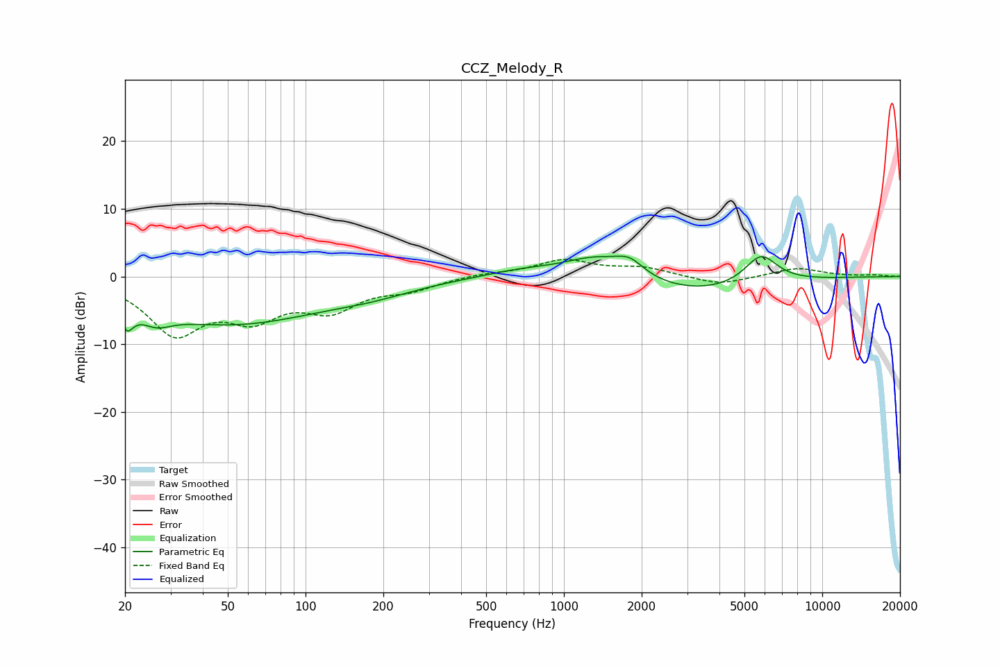

# CCZ_Melody_R
See [usage instructions](https://github.com/jaakkopasanen/AutoEq#usage) for more options and info.

### Parametric EQs
Apply preamp of -3.1 dB when using parametric equalizer.

|   # | Type    |   Fc (Hz) |    Q |   Gain (dB) |
|-----|---------|-----------|------|-------------|
|   1 | Peaking |        20 | 5.67 |         3.4 |
|   2 | Peaking |        20 | 5.72 |        -6.4 |
|   3 | Peaking |        26 | 2.48 |        -1.9 |
|   4 | Peaking |        51 | 0.37 |        -6.9 |
|   5 | Peaking |       183 | 0.86 |        -1.1 |
|   6 | Peaking |       683 | 0.97 |         1   |
|   7 | Peaking |      1341 | 1.1  |         3.2 |
|   8 | Peaking |      1797 | 2.57 |         2.1 |
|   9 | Peaking |      3230 | 0.56 |        -2.6 |
|  10 | Peaking |      5791 | 2.14 |         4.4 |

### Fixed Band EQs
When using fixed band (also called graphic) equalizer, apply preamp of **-2.6 dB** (if available) and set gains manually with these parameters.

|   # | Type    |   Fc (Hz) |    Q |   Gain (dB) |
|-----|---------|-----------|------|-------------|
|   1 | Peaking |        31 | 1.41 |        -7.9 |
|   2 | Peaking |        62 | 1.41 |        -5   |
|   3 | Peaking |       125 | 1.41 |        -4.3 |
|   4 | Peaking |       250 | 1.41 |        -1.6 |
|   5 | Peaking |       500 | 1.41 |         0.4 |
|   6 | Peaking |      1000 | 1.41 |         2.4 |
|   7 | Peaking |      2000 | 1.41 |         1.2 |
|   8 | Peaking |      4000 | 1.41 |        -1.3 |
|   9 | Peaking |      8000 | 1.41 |         1.3 |
|  10 | Peaking |     16000 | 1.41 |         0.2 |

### Graphs

