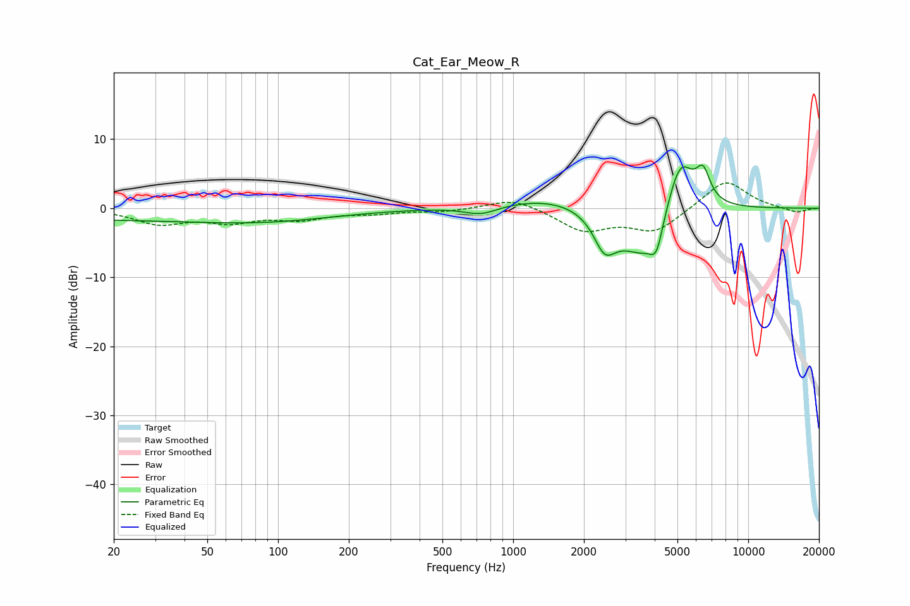

# Cat_Ear_Meow_R
See [usage instructions](https://github.com/jaakkopasanen/AutoEq#usage) for more options and info.

### Parametric EQs
Apply preamp of -6.4 dB when using parametric equalizer.

|   # | Type    |   Fc (Hz) |    Q |   Gain (dB) |
|-----|---------|-----------|------|-------------|
|   1 | Peaking |        20 | 0.21 |        -1.6 |
|   2 | Peaking |       100 | 0.49 |        -1.2 |
|   3 | Peaking |       731 | 1.96 |        -1.3 |
|   4 | Peaking |      1464 | 0.69 |         1.7 |
|   5 | Peaking |      2446 | 3.02 |        -4.8 |
|   6 | Peaking |      2793 | 2.3  |        -0.8 |
|   7 | Peaking |      3578 | 1.51 |        -6.8 |
|   8 | Peaking |      4069 | 5.16 |        -3.9 |
|   9 | Peaking |      5136 | 2.31 |         8.4 |
|  10 | Peaking |      6427 | 4.66 |         4.1 |

### Fixed Band EQs
When using fixed band (also called graphic) equalizer, apply preamp of **-3.7 dB** (if available) and set gains manually with these parameters.

|   # | Type    |   Fc (Hz) |    Q |   Gain (dB) |
|-----|---------|-----------|------|-------------|
|   1 | Peaking |        31 | 1.41 |        -2.1 |
|   2 | Peaking |        62 | 1.41 |        -1.7 |
|   3 | Peaking |       125 | 1.41 |        -1.4 |
|   4 | Peaking |       250 | 1.41 |        -0.6 |
|   5 | Peaking |       500 | 1.41 |        -0.5 |
|   6 | Peaking |      1000 | 1.41 |         1.6 |
|   7 | Peaking |      2000 | 1.41 |        -3.2 |
|   8 | Peaking |      4000 | 1.41 |        -3.3 |
|   9 | Peaking |      8000 | 1.41 |         4.2 |
|  10 | Peaking |     16000 | 1.41 |        -0.7 |

### Graphs

