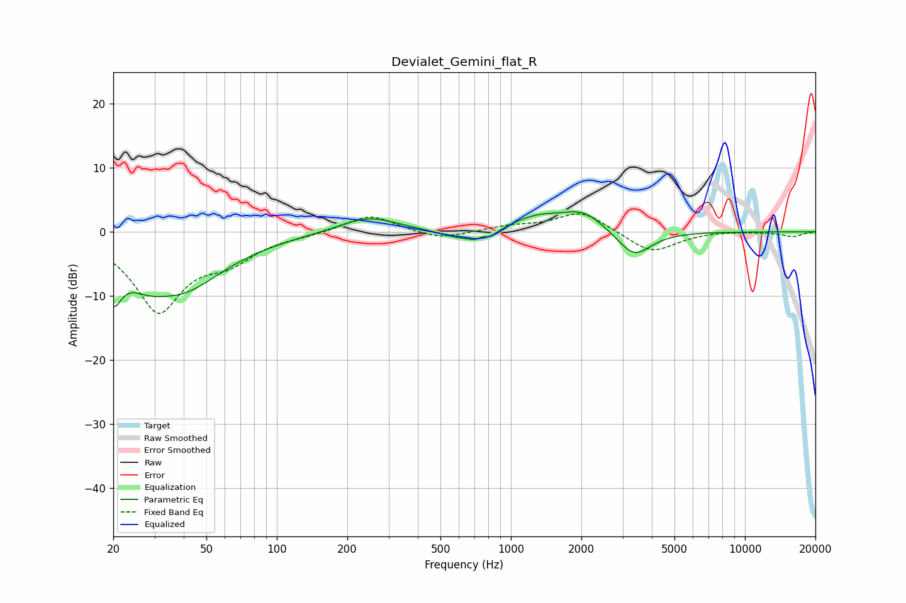

# Devialet_Gemini_flat_R
See [usage instructions](https://github.com/jaakkopasanen/AutoEq#usage) for more options and info.

### Parametric EQs
Apply preamp of -3.2 dB when using parametric equalizer.

|   # | Type    |   Fc (Hz) |    Q |   Gain (dB) |
|-----|---------|-----------|------|-------------|
|   1 | Peaking |        20 | 3.94 |        -6.6 |
|   2 | Peaking |        27 | 1.7  |        -2.6 |
|   3 | Peaking |        39 | 0.76 |        -8.5 |
|   4 | Peaking |       245 | 1.14 |         2.5 |
|   5 | Peaking |       583 | 1.82 |        -1.1 |
|   6 | Peaking |       758 | 5.43 |         2.8 |
|   7 | Peaking |       759 | 3.74 |        -4.1 |
|   8 | Peaking |      1293 | 1.28 |         2.1 |
|   9 | Peaking |      2041 | 1.55 |         2.9 |
|  10 | Peaking |      3361 | 1.93 |        -4.2 |

### Fixed Band EQs
When using fixed band (also called graphic) equalizer, apply preamp of **-2.9 dB** (if available) and set gains manually with these parameters.

|   # | Type    |   Fc (Hz) |    Q |   Gain (dB) |
|-----|---------|-----------|------|-------------|
|   1 | Peaking |        31 | 1.41 |       -12.1 |
|   2 | Peaking |        62 | 1.41 |        -3.4 |
|   3 | Peaking |       125 | 1.41 |        -0.4 |
|   4 | Peaking |       250 | 1.41 |         2.8 |
|   5 | Peaking |       500 | 1.41 |        -1.3 |
|   6 | Peaking |      1000 | 1.41 |         0.8 |
|   7 | Peaking |      2000 | 1.41 |         3.2 |
|   8 | Peaking |      4000 | 1.41 |        -3.4 |
|   9 | Peaking |      8000 | 1.41 |         0.2 |
|  10 | Peaking |     16000 | 1.41 |        -0.7 |

### Graphs

