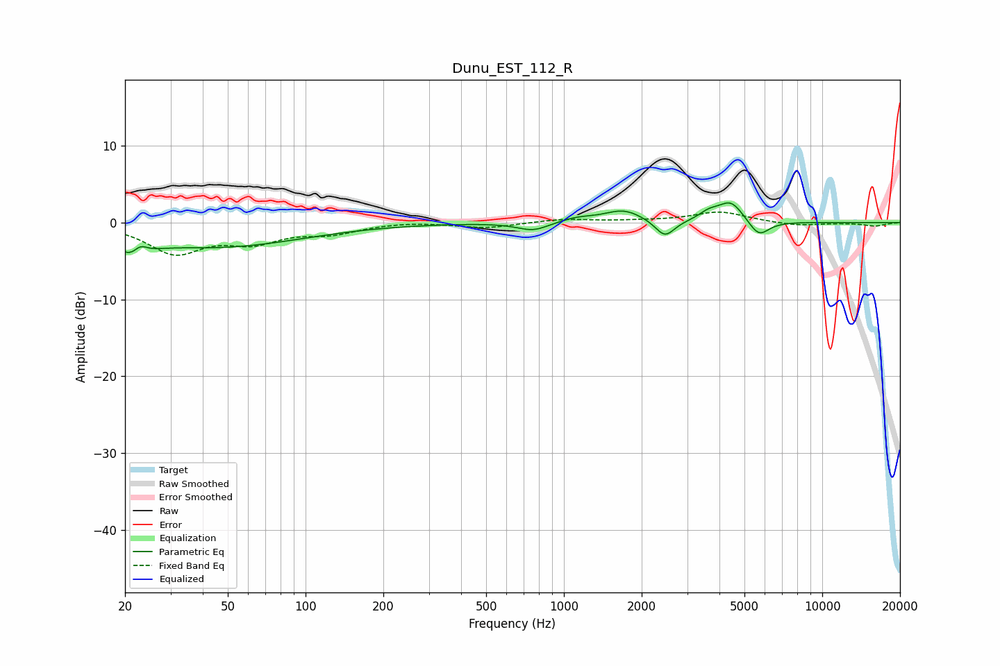

# Dunu_EST_112_R
See [usage instructions](https://github.com/jaakkopasanen/AutoEq#usage) for more options and info.

### Parametric EQs
Apply preamp of -2.7 dB when using parametric equalizer.

|   # | Type    |   Fc (Hz) |    Q |   Gain (dB) |
|-----|---------|-----------|------|-------------|
|   1 | Peaking |        22 | 2.55 |        -3   |
|   2 | Peaking |        23 | 4.75 |         1.9 |
|   3 | Peaking |        45 | 0.42 |        -3.1 |
|   4 | Peaking |       760 | 2.33 |        -1.1 |
|   5 | Peaking |      1120 | 2.18 |         0.6 |
|   6 | Peaking |      1703 | 1.9  |         1.6 |
|   7 | Peaking |      2462 | 3.77 |        -2.3 |
|   8 | Peaking |      3637 | 3.7  |         0.9 |
|   9 | Peaking |      4425 | 2.83 |         2.7 |
|  10 | Peaking |      5680 | 3.49 |        -2.2 |

### Fixed Band EQs
When using fixed band (also called graphic) equalizer, apply preamp of **-1.5 dB** (if available) and set gains manually with these parameters.

|   # | Type    |   Fc (Hz) |    Q |   Gain (dB) |
|-----|---------|-----------|------|-------------|
|   1 | Peaking |        31 | 1.41 |        -3.8 |
|   2 | Peaking |        62 | 1.41 |        -2.2 |
|   3 | Peaking |       125 | 1.41 |        -1.2 |
|   4 | Peaking |       250 | 1.41 |         0.2 |
|   5 | Peaking |       500 | 1.41 |        -0.7 |
|   6 | Peaking |      1000 | 1.41 |         0.5 |
|   7 | Peaking |      2000 | 1.41 |         0.1 |
|   8 | Peaking |      4000 | 1.41 |         1.4 |
|   9 | Peaking |      8000 | 1.41 |        -0.4 |
|  10 | Peaking |     16000 | 1.41 |        -0.4 |

### Graphs

