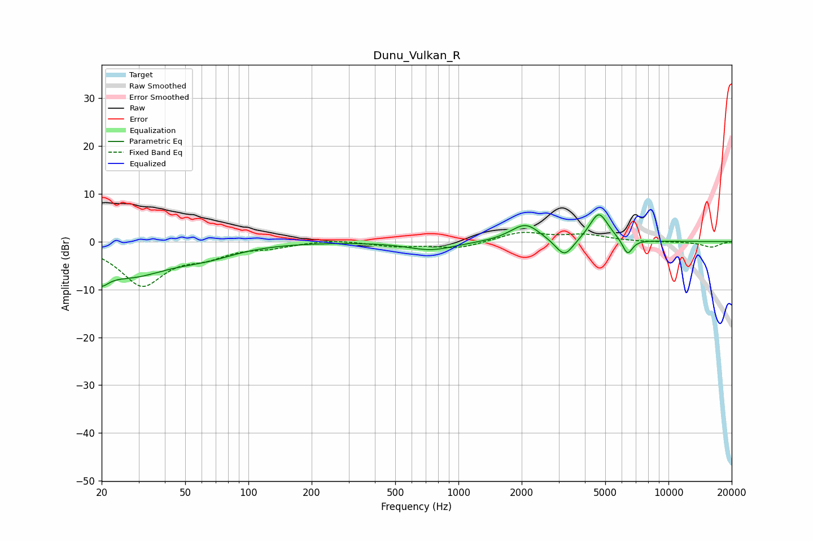

# Dunu_Vulkan_R
See [usage instructions](https://github.com/jaakkopasanen/AutoEq#usage) for more options and info.

### Parametric EQs
Apply preamp of -5.7 dB when using parametric equalizer.

|   # | Type    |   Fc (Hz) |    Q |   Gain (dB) |
|-----|---------|-----------|------|-------------|
|   1 | Peaking |        20 | 4.67 |        -6.9 |
|   2 | Peaking |        20 | 5.5  |         3.5 |
|   3 | Peaking |        27 | 0.72 |        -6.7 |
|   4 | Peaking |        64 | 1    |        -1.8 |
|   5 | Peaking |       740 | 1.27 |        -1.8 |
|   6 | Peaking |      1906 | 1.92 |         0.7 |
|   7 | Peaking |      2111 | 2.16 |         3.1 |
|   8 | Peaking |      3200 | 3.28 |        -3.9 |
|   9 | Peaking |      4662 | 3.08 |         6.1 |
|  10 | Peaking |      6381 | 5.69 |        -3.4 |

### Fixed Band EQs
When using fixed band (also called graphic) equalizer, apply preamp of **-2.0 dB** (if available) and set gains manually with these parameters.

|   # | Type    |   Fc (Hz) |    Q |   Gain (dB) |
|-----|---------|-----------|------|-------------|
|   1 | Peaking |        31 | 1.41 |        -8.9 |
|   2 | Peaking |        62 | 1.41 |        -2.3 |
|   3 | Peaking |       125 | 1.41 |        -1   |
|   4 | Peaking |       250 | 1.41 |         0.5 |
|   5 | Peaking |       500 | 1.41 |        -0.9 |
|   6 | Peaking |      1000 | 1.41 |        -1.4 |
|   7 | Peaking |      2000 | 1.41 |         2   |
|   8 | Peaking |      4000 | 1.41 |         1.3 |
|   9 | Peaking |      8000 | 1.41 |        -0.1 |
|  10 | Peaking |     16000 | 1.41 |        -1.2 |

### Graphs

