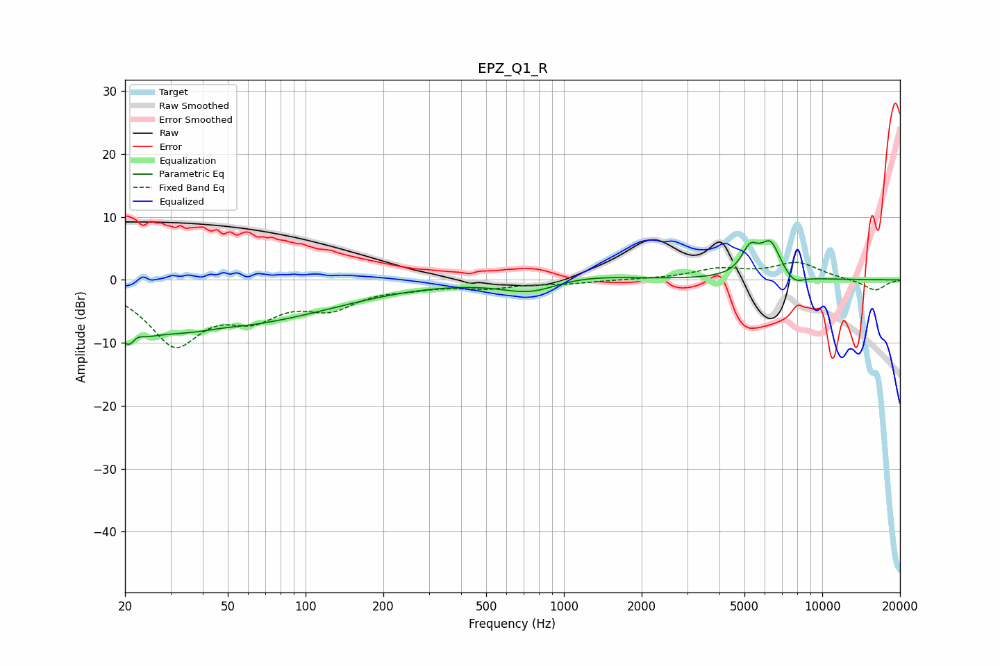

# EPZ_Q1_R
See [usage instructions](https://github.com/jaakkopasanen/AutoEq#usage) for more options and info.

### Parametric EQs
Apply preamp of -6.3 dB when using parametric equalizer.

|   # | Type    |   Fc (Hz) |    Q |   Gain (dB) |
|-----|---------|-----------|------|-------------|
|   1 | Peaking |        21 | 3.55 |        -6.3 |
|   2 | Peaking |        22 | 4.93 |         3.9 |
|   3 | Peaking |        30 | 0.4  |        -7.2 |
|   4 | Peaking |        48 | 1.79 |         0.3 |
|   5 | Peaking |        95 | 0.48 |        -2.6 |
|   6 | Peaking |       746 | 1.25 |        -2.2 |
|   7 | Peaking |      1135 | 0.81 |         1   |
|   8 | Peaking |      5258 | 4.02 |         4.1 |
|   9 | Peaking |      6306 | 3.42 |         5.4 |
|  10 | Peaking |      7765 | 3.48 |        -1.5 |

### Fixed Band EQs
When using fixed band (also called graphic) equalizer, apply preamp of **-2.9 dB** (if available) and set gains manually with these parameters.

|   # | Type    |   Fc (Hz) |    Q |   Gain (dB) |
|-----|---------|-----------|------|-------------|
|   1 | Peaking |        31 | 1.41 |        -9.8 |
|   2 | Peaking |        62 | 1.41 |        -4.6 |
|   3 | Peaking |       125 | 1.41 |        -3.7 |
|   4 | Peaking |       250 | 1.41 |        -0.8 |
|   5 | Peaking |       500 | 1.41 |        -1.1 |
|   6 | Peaking |      1000 | 1.41 |        -0.5 |
|   7 | Peaking |      2000 | 1.41 |         0   |
|   8 | Peaking |      4000 | 1.41 |         1.6 |
|   9 | Peaking |      8000 | 1.41 |         2.6 |
|  10 | Peaking |     16000 | 1.41 |        -1.7 |

### Graphs

