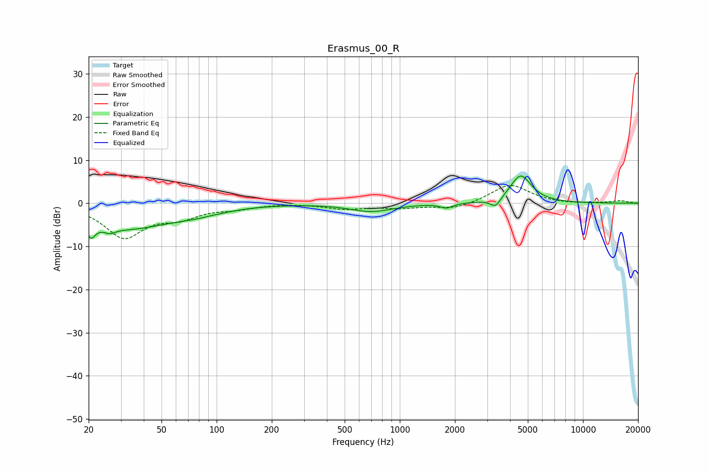

# Erasmus_00_R
See [usage instructions](https://github.com/jaakkopasanen/AutoEq#usage) for more options and info.

### Parametric EQs
Apply preamp of -6.4 dB when using parametric equalizer.

|   # | Type    |   Fc (Hz) |    Q |   Gain (dB) |
|-----|---------|-----------|------|-------------|
|   1 | Peaking |        20 | 5.68 |         3.3 |
|   2 | Peaking |        21 | 5.74 |        -6.7 |
|   3 | Peaking |        26 | 4.68 |        -1.1 |
|   4 | Peaking |        32 | 0.55 |        -5.7 |
|   5 | Peaking |        83 | 1.14 |        -1.1 |
|   6 | Peaking |        91 | 3.24 |         0.1 |
|   7 | Peaking |       701 | 1.21 |        -1.9 |
|   8 | Peaking |      1798 | 4.33 |        -1.1 |
|   9 | Peaking |      3335 | 4.91 |        -2.2 |
|  10 | Peaking |      4572 | 2.41 |         6.5 |

### Fixed Band EQs
When using fixed band (also called graphic) equalizer, apply preamp of **-4.2 dB** (if available) and set gains manually with these parameters.

|   # | Type    |   Fc (Hz) |    Q |   Gain (dB) |
|-----|---------|-----------|------|-------------|
|   1 | Peaking |        31 | 1.41 |        -7.7 |
|   2 | Peaking |        62 | 1.41 |        -2.7 |
|   3 | Peaking |       125 | 1.41 |        -1   |
|   4 | Peaking |       250 | 1.41 |         0.1 |
|   5 | Peaking |       500 | 1.41 |        -1.2 |
|   6 | Peaking |      1000 | 1.41 |        -1   |
|   7 | Peaking |      2000 | 1.41 |        -1.4 |
|   8 | Peaking |      4000 | 1.41 |         4.4 |
|   9 | Peaking |      8000 | 1.41 |        -0.2 |
|  10 | Peaking |     16000 | 1.41 |         0.6 |

### Graphs

