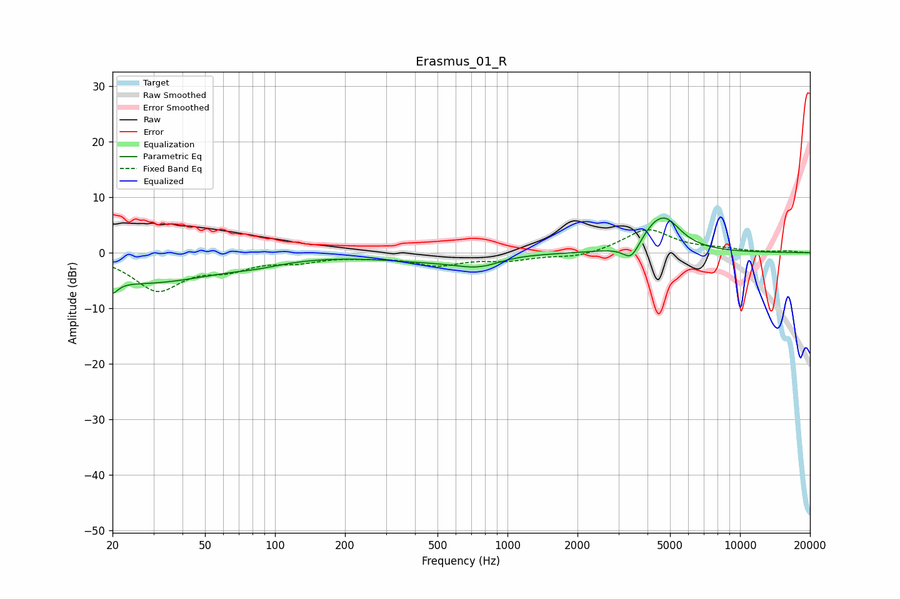

# Erasmus_01_R
See [usage instructions](https://github.com/jaakkopasanen/AutoEq#usage) for more options and info.

### Parametric EQs
Apply preamp of -6.3 dB when using parametric equalizer.

|   # | Type    |   Fc (Hz) |    Q |   Gain (dB) |
|-----|---------|-----------|------|-------------|
|   1 | Peaking |        20 | 5.71 |        -5.7 |
|   2 | Peaking |        20 | 5.81 |         3.3 |
|   3 | Peaking |        27 | 0.44 |        -5.3 |
|   4 | Peaking |        84 | 1.35 |        -0.6 |
|   5 | Peaking |       431 | 0.67 |        -1.1 |
|   6 | Peaking |       778 | 1.24 |        -2.6 |
|   7 | Peaking |       937 | 1.17 |         0.9 |
|   8 | Peaking |      3405 | 4.04 |        -2.9 |
|   9 | Peaking |      4116 | 2.69 |         1.4 |
|  10 | Peaking |      4744 | 1.97 |         5.7 |

### Fixed Band EQs
When using fixed band (also called graphic) equalizer, apply preamp of **-4.2 dB** (if available) and set gains manually with these parameters.

|   # | Type    |   Fc (Hz) |    Q |   Gain (dB) |
|-----|---------|-----------|------|-------------|
|   1 | Peaking |        31 | 1.41 |        -6.5 |
|   2 | Peaking |        62 | 1.41 |        -2.3 |
|   3 | Peaking |       125 | 1.41 |        -1.3 |
|   4 | Peaking |       250 | 1.41 |        -0.5 |
|   5 | Peaking |       500 | 1.41 |        -2.1 |
|   6 | Peaking |      1000 | 1.41 |        -1.2 |
|   7 | Peaking |      2000 | 1.41 |        -0.9 |
|   8 | Peaking |      4000 | 1.41 |         4.2 |
|   9 | Peaking |      8000 | 1.41 |         0.5 |
|  10 | Peaking |     16000 | 1.41 |         0.3 |

### Graphs

