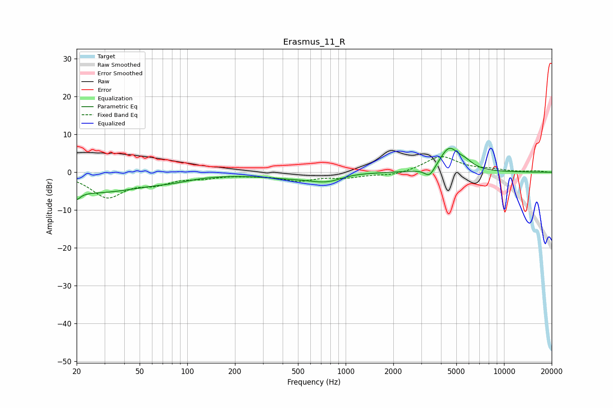

# Erasmus_11_R
See [usage instructions](https://github.com/jaakkopasanen/AutoEq#usage) for more options and info.

### Parametric EQs
Apply preamp of -6.4 dB when using parametric equalizer.

|   # | Type    |   Fc (Hz) |    Q |   Gain (dB) |
|-----|---------|-----------|------|-------------|
|   1 | Peaking |        20 | 5.72 |        -5.5 |
|   2 | Peaking |        20 | 5.79 |         3.3 |
|   3 | Peaking |        26 | 0.4  |        -5.3 |
|   4 | Peaking |        82 | 1.35 |        -0.6 |
|   5 | Peaking |       434 | 0.7  |        -1.1 |
|   6 | Peaking |       787 | 1.18 |        -2.5 |
|   7 | Peaking |       995 | 1.17 |         0.9 |
|   8 | Peaking |      3393 | 4.28 |        -2.7 |
|   9 | Peaking |      4498 | 2.32 |         6.2 |
|  10 | Peaking |      5675 | 2.84 |         1.5 |

### Fixed Band EQs
When using fixed band (also called graphic) equalizer, apply preamp of **-4.2 dB** (if available) and set gains manually with these parameters.

|   # | Type    |   Fc (Hz) |    Q |   Gain (dB) |
|-----|---------|-----------|------|-------------|
|   1 | Peaking |        31 | 1.41 |        -6.3 |
|   2 | Peaking |        62 | 1.41 |        -2.4 |
|   3 | Peaking |       125 | 1.41 |        -1.1 |
|   4 | Peaking |       250 | 1.41 |        -0.5 |
|   5 | Peaking |       500 | 1.41 |        -2   |
|   6 | Peaking |      1000 | 1.41 |        -1.2 |
|   7 | Peaking |      2000 | 1.41 |        -0.9 |
|   8 | Peaking |      4000 | 1.41 |         4.2 |
|   9 | Peaking |      8000 | 1.41 |         0.6 |
|  10 | Peaking |     16000 | 1.41 |         0.3 |

### Graphs

