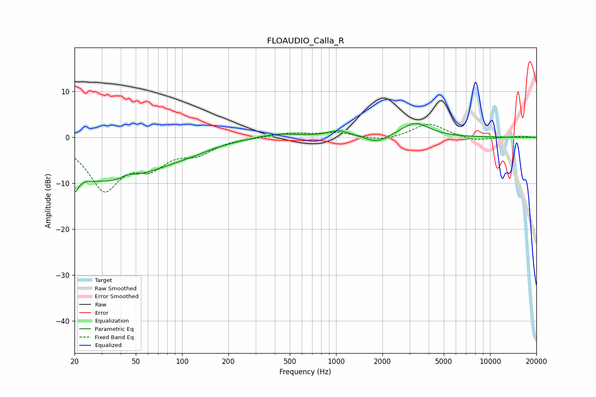

# FLOAUDIO_Calla_R
See [usage instructions](https://github.com/jaakkopasanen/AutoEq#usage) for more options and info.

### Parametric EQs
Apply preamp of -3.1 dB when using parametric equalizer.

|   # | Type    |   Fc (Hz) |    Q |   Gain (dB) |
|-----|---------|-----------|------|-------------|
|   1 | Peaking |        20 | 6    |         5.6 |
|   2 | Peaking |        20 | 5.83 |        -9.8 |
|   3 | Peaking |        31 | 0.47 |        -8.7 |
|   4 | Peaking |        45 | 3.3  |         0.8 |
|   5 | Peaking |        77 | 0.61 |        -2   |
|   6 | Peaking |       121 | 1.58 |        -0.4 |
|   7 | Peaking |       413 | 1.03 |         1   |
|   8 | Peaking |      1046 | 2.03 |         1.4 |
|   9 | Peaking |      1847 | 2.04 |        -1.6 |
|  10 | Peaking |      3268 | 1.56 |         3.2 |

### Fixed Band EQs
When using fixed band (also called graphic) equalizer, apply preamp of **-2.9 dB** (if available) and set gains manually with these parameters.

|   # | Type    |   Fc (Hz) |    Q |   Gain (dB) |
|-----|---------|-----------|------|-------------|
|   1 | Peaking |        31 | 1.41 |       -10.9 |
|   2 | Peaking |        62 | 1.41 |        -5   |
|   3 | Peaking |       125 | 1.41 |        -3   |
|   4 | Peaking |       250 | 1.41 |        -0   |
|   5 | Peaking |       500 | 1.41 |         0.9 |
|   6 | Peaking |      1000 | 1.41 |         1   |
|   7 | Peaking |      2000 | 1.41 |        -0.9 |
|   8 | Peaking |      4000 | 1.41 |         3.1 |
|   9 | Peaking |      8000 | 1.41 |        -0.8 |
|  10 | Peaking |     16000 | 1.41 |         0.3 |

### Graphs

