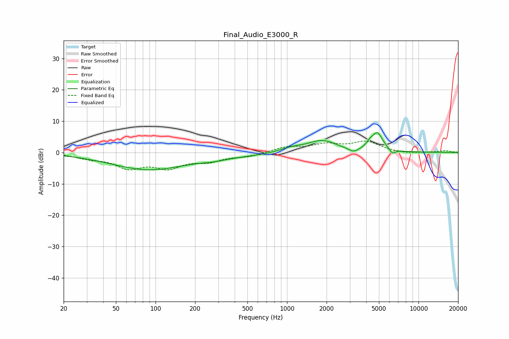

# Final_Audio_E3000_R
See [usage instructions](https://github.com/jaakkopasanen/AutoEq#usage) for more options and info.

### Parametric EQs
Apply preamp of -6.4 dB when using parametric equalizer.

|   # | Type    |   Fc (Hz) |    Q |   Gain (dB) |
|-----|---------|-----------|------|-------------|
|   1 | Peaking |        89 | 0.48 |        -5.4 |
|   2 | Peaking |       273 | 1.57 |        -0.6 |
|   3 | Peaking |       444 | 0.63 |        -0.7 |
|   4 | Peaking |      1049 | 1.84 |         0.9 |
|   5 | Peaking |      1219 | 1.59 |         0.4 |
|   6 | Peaking |      1856 | 1.28 |         3.7 |
|   7 | Peaking |      3204 | 3.63 |        -1.3 |
|   8 | Peaking |      4267 | 5.64 |         1.2 |
|   9 | Peaking |      4864 | 3.27 |         5.8 |
|  10 | Peaking |      6331 | 5.95 |        -1.6 |

### Fixed Band EQs
When using fixed band (also called graphic) equalizer, apply preamp of **-3.8 dB** (if available) and set gains manually with these parameters.

|   # | Type    |   Fc (Hz) |    Q |   Gain (dB) |
|-----|---------|-----------|------|-------------|
|   1 | Peaking |        31 | 1.41 |        -1.5 |
|   2 | Peaking |        62 | 1.41 |        -4.4 |
|   3 | Peaking |       125 | 1.41 |        -4.3 |
|   4 | Peaking |       250 | 1.41 |        -2.4 |
|   5 | Peaking |       500 | 1.41 |        -1.2 |
|   6 | Peaking |      1000 | 1.41 |         1.7 |
|   7 | Peaking |      2000 | 1.41 |         2.3 |
|   8 | Peaking |      4000 | 1.41 |         3.3 |
|   9 | Peaking |      8000 | 1.41 |        -0.4 |
|  10 | Peaking |     16000 | 1.41 |         0.6 |

### Graphs

