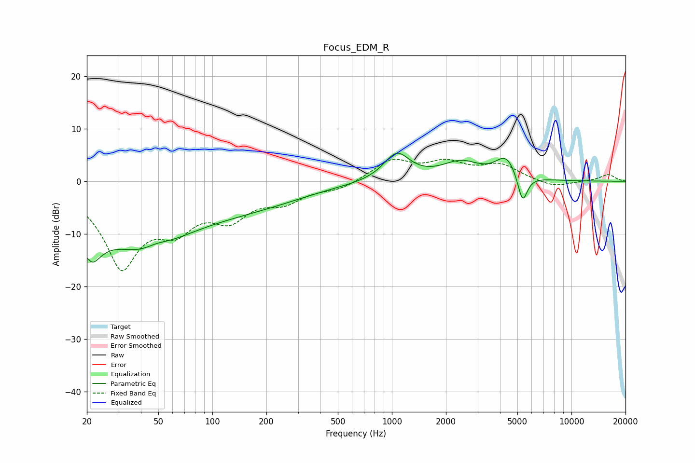

# Focus_EDM_R
See [usage instructions](https://github.com/jaakkopasanen/AutoEq#usage) for more options and info.

### Parametric EQs
Apply preamp of -5.4 dB when using parametric equalizer.

|   # | Type    |   Fc (Hz) |    Q |   Gain (dB) |
|-----|---------|-----------|------|-------------|
|   1 | Peaking |        20 | 2.28 |       -11.6 |
|   2 | Peaking |        20 | 5.98 |         3.7 |
|   3 | Peaking |        42 | 0.55 |       -11.5 |
|   4 | Peaking |        49 | 2.03 |         1.2 |
|   5 | Peaking |       140 | 0.44 |        -2.9 |
|   6 | Peaking |       223 | 0.59 |        -1   |
|   7 | Peaking |      1065 | 1.94 |         5.2 |
|   8 | Peaking |      2421 | 1.31 |         3.3 |
|   9 | Peaking |      4332 | 2.37 |         4.1 |
|  10 | Peaking |      5343 | 5.09 |        -5.6 |

### Fixed Band EQs
When using fixed band (also called graphic) equalizer, apply preamp of **-4.3 dB** (if available) and set gains manually with these parameters.

|   # | Type    |   Fc (Hz) |    Q |   Gain (dB) |
|-----|---------|-----------|------|-------------|
|   1 | Peaking |        31 | 1.41 |       -15.5 |
|   2 | Peaking |        62 | 1.41 |        -6.5 |
|   3 | Peaking |       125 | 1.41 |        -5.8 |
|   4 | Peaking |       250 | 1.41 |        -3.2 |
|   5 | Peaking |       500 | 1.41 |        -1.4 |
|   6 | Peaking |      1000 | 1.41 |         3.9 |
|   7 | Peaking |      2000 | 1.41 |         3.1 |
|   8 | Peaking |      4000 | 1.41 |         2.9 |
|   9 | Peaking |      8000 | 1.41 |        -1.2 |
|  10 | Peaking |     16000 | 1.41 |         1.3 |

### Graphs

