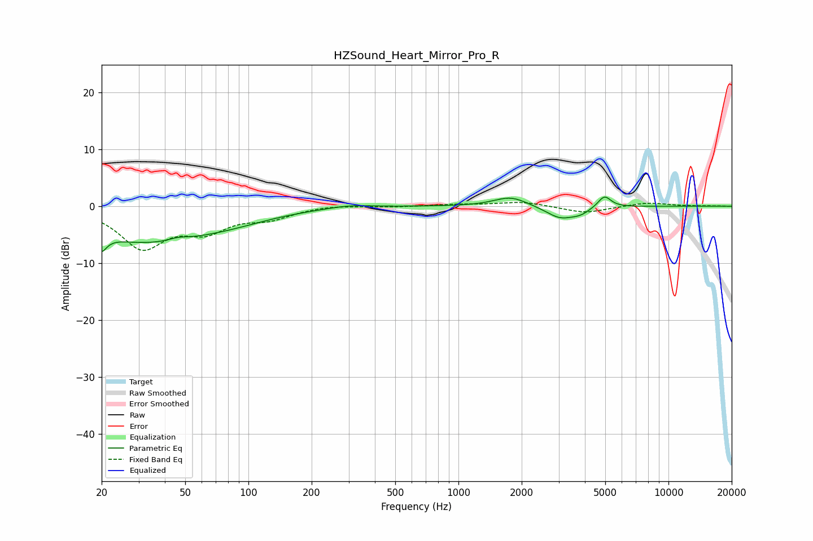

# HZSound_Heart_Mirror_Pro_R
See [usage instructions](https://github.com/jaakkopasanen/AutoEq#usage) for more options and info.

### Parametric EQs
Apply preamp of -1.7 dB when using parametric equalizer.

|   # | Type    |   Fc (Hz) |    Q |   Gain (dB) |
|-----|---------|-----------|------|-------------|
|   1 | Peaking |        20 | 5.69 |        -6.2 |
|   2 | Peaking |        20 | 5.86 |         3.3 |
|   3 | Peaking |        31 | 0.48 |        -5.9 |
|   4 | Peaking |        46 | 3.28 |         0.5 |
|   5 | Peaking |        81 | 0.68 |        -1.5 |
|   6 | Peaking |       303 | 1.41 |         0.5 |
|   7 | Peaking |      1774 | 1.79 |         1.7 |
|   8 | Peaking |      3052 | 2.05 |        -2.1 |
|   9 | Peaking |      3805 | 3.12 |        -0.9 |
|  10 | Peaking |      4955 | 4.57 |         2.1 |

### Fixed Band EQs
When using fixed band (also called graphic) equalizer, apply preamp of **-0.7 dB** (if available) and set gains manually with these parameters.

|   # | Type    |   Fc (Hz) |    Q |   Gain (dB) |
|-----|---------|-----------|------|-------------|
|   1 | Peaking |        31 | 1.41 |        -7   |
|   2 | Peaking |        62 | 1.41 |        -3.7 |
|   3 | Peaking |       125 | 1.41 |        -1.8 |
|   4 | Peaking |       250 | 1.41 |         0.3 |
|   5 | Peaking |       500 | 1.41 |        -0.1 |
|   6 | Peaking |      1000 | 1.41 |         0.3 |
|   7 | Peaking |      2000 | 1.41 |         0.8 |
|   8 | Peaking |      4000 | 1.41 |        -1.2 |
|   9 | Peaking |      8000 | 1.41 |         0.7 |
|  10 | Peaking |     16000 | 1.41 |         0   |

### Graphs

