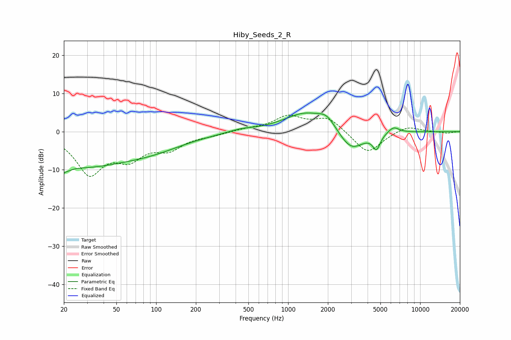

# Hiby_Seeds_2_R
See [usage instructions](https://github.com/jaakkopasanen/AutoEq#usage) for more options and info.

### Parametric EQs
Apply preamp of -5.0 dB when using parametric equalizer.

|   # | Type    |   Fc (Hz) |    Q |   Gain (dB) |
|-----|---------|-----------|------|-------------|
|   1 | Peaking |        20 | 4.48 |        -5.8 |
|   2 | Peaking |        20 | 5.7  |         3.3 |
|   3 | Peaking |        26 | 0.41 |        -8.3 |
|   4 | Peaking |        93 | 0.54 |        -3.3 |
|   5 | Peaking |       439 | 1.5  |         0.7 |
|   6 | Peaking |      1353 | 0.86 |         4.9 |
|   7 | Peaking |      1965 | 2.24 |         2.7 |
|   8 | Peaking |      3002 | 1.46 |        -5.6 |
|   9 | Peaking |      4668 | 4.91 |        -3.8 |
|  10 | Peaking |      6278 | 3.27 |         1.7 |

### Fixed Band EQs
When using fixed band (also called graphic) equalizer, apply preamp of **-4.4 dB** (if available) and set gains manually with these parameters.

|   # | Type    |   Fc (Hz) |    Q |   Gain (dB) |
|-----|---------|-----------|------|-------------|
|   1 | Peaking |        31 | 1.41 |       -10.5 |
|   2 | Peaking |        62 | 1.41 |        -5.7 |
|   3 | Peaking |       125 | 1.41 |        -3.9 |
|   4 | Peaking |       250 | 1.41 |        -0.7 |
|   5 | Peaking |       500 | 1.41 |         0.6 |
|   6 | Peaking |      1000 | 1.41 |         3.8 |
|   7 | Peaking |      2000 | 1.41 |         3.6 |
|   8 | Peaking |      4000 | 1.41 |        -5.9 |
|   9 | Peaking |      8000 | 1.41 |         1.7 |
|  10 | Peaking |     16000 | 1.41 |        -0.4 |

### Graphs

