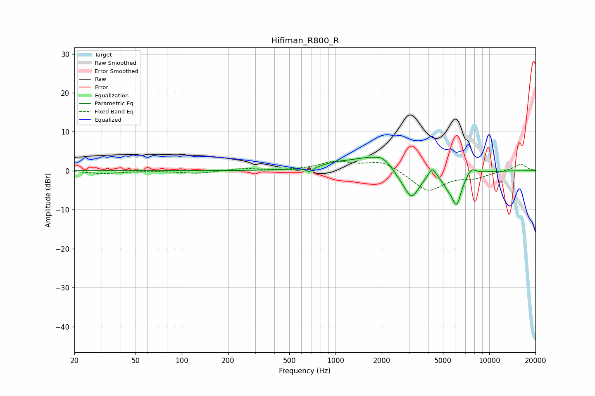

# Hifiman_R800_R
See [usage instructions](https://github.com/jaakkopasanen/AutoEq#usage) for more options and info.

### Parametric EQs
Apply preamp of -3.6 dB when using parametric equalizer.

|   # | Type    |   Fc (Hz) |    Q |   Gain (dB) |
|-----|---------|-----------|------|-------------|
|   1 | Peaking |       680 | 6    |        -1.1 |
|   2 | Peaking |      1004 | 1.49 |         1.1 |
|   3 | Peaking |      1793 | 1    |         3.7 |
|   4 | Peaking |      2024 | 3.85 |         0.9 |
|   5 | Peaking |      2586 | 4.06 |        -0.8 |
|   6 | Peaking |      3119 | 2.63 |        -7.7 |
|   7 | Peaking |      4251 | 6    |         2.5 |
|   8 | Peaking |      5320 | 4.72 |        -1.7 |
|   9 | Peaking |      6122 | 3.99 |        -8.3 |
|  10 | Peaking |      7617 | 4.53 |         1.9 |

### Fixed Band EQs
When using fixed band (also called graphic) equalizer, apply preamp of **-2.6 dB** (if available) and set gains manually with these parameters.

|   # | Type    |   Fc (Hz) |    Q |   Gain (dB) |
|-----|---------|-----------|------|-------------|
|   1 | Peaking |        31 | 1.41 |        -0.7 |
|   2 | Peaking |        62 | 1.41 |        -0   |
|   3 | Peaking |       125 | 1.41 |        -0.7 |
|   4 | Peaking |       250 | 1.41 |         0.6 |
|   5 | Peaking |       500 | 1.41 |        -0   |
|   6 | Peaking |      1000 | 1.41 |         2.2 |
|   7 | Peaking |      2000 | 1.41 |         2.6 |
|   8 | Peaking |      4000 | 1.41 |        -5.3 |
|   9 | Peaking |      8000 | 1.41 |        -1.5 |
|  10 | Peaking |     16000 | 1.41 |         1.7 |

### Graphs

