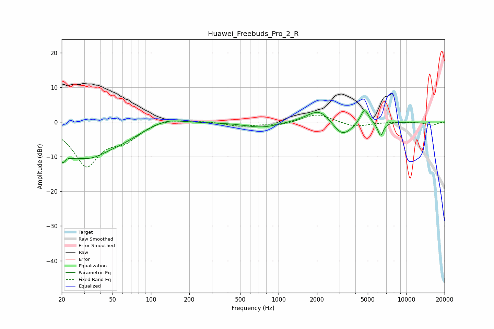

# Huawei_Freebuds_Pro_2_R
See [usage instructions](https://github.com/jaakkopasanen/AutoEq#usage) for more options and info.

### Parametric EQs
Apply preamp of -3.4 dB when using parametric equalizer.

|   # | Type    |   Fc (Hz) |    Q |   Gain (dB) |
|-----|---------|-----------|------|-------------|
|   1 | Peaking |        21 | 3.42 |        -8.2 |
|   2 | Peaking |        22 | 5.1  |         3.7 |
|   3 | Peaking |        32 | 0.72 |        -9.4 |
|   4 | Peaking |        61 | 1.04 |        -1.6 |
|   5 | Peaking |       133 | 1.19 |         1.8 |
|   6 | Peaking |       739 | 1.06 |        -1.6 |
|   7 | Peaking |      2108 | 1.45 |         4.4 |
|   8 | Peaking |      3145 | 1.75 |        -5   |
|   9 | Peaking |      4710 | 4.2  |         4.5 |
|  10 | Peaking |      6300 | 6    |        -4.1 |

### Fixed Band EQs
When using fixed band (also called graphic) equalizer, apply preamp of **-2.1 dB** (if available) and set gains manually with these parameters.

|   # | Type    |   Fc (Hz) |    Q |   Gain (dB) |
|-----|---------|-----------|------|-------------|
|   1 | Peaking |        31 | 1.41 |       -12.3 |
|   2 | Peaking |        62 | 1.41 |        -4.1 |
|   3 | Peaking |       125 | 1.41 |         1.1 |
|   4 | Peaking |       250 | 1.41 |         0.4 |
|   5 | Peaking |       500 | 1.41 |        -1.1 |
|   6 | Peaking |      1000 | 1.41 |        -0.9 |
|   7 | Peaking |      2000 | 1.41 |         2.5 |
|   8 | Peaking |      4000 | 1.41 |        -1.5 |
|   9 | Peaking |      8000 | 1.41 |         0   |
|  10 | Peaking |     16000 | 1.41 |        -0.9 |

### Graphs

