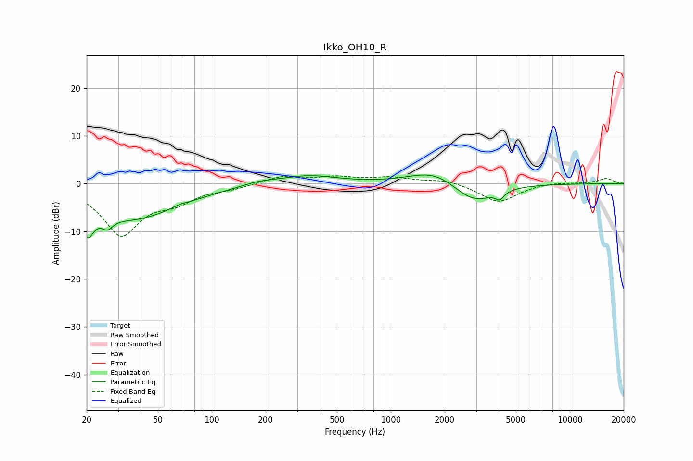

# Ikko_OH10_R
See [usage instructions](https://github.com/jaakkopasanen/AutoEq#usage) for more options and info.

### Parametric EQs
Apply preamp of -1.9 dB when using parametric equalizer.

|   # | Type    |   Fc (Hz) |    Q |   Gain (dB) |
|-----|---------|-----------|------|-------------|
|   1 | Peaking |        20 | 4.63 |        -9.4 |
|   2 | Peaking |        20 | 5.47 |         3.4 |
|   3 | Peaking |        26 | 4.72 |        -2.2 |
|   4 | Peaking |        36 | 0.54 |        -7.2 |
|   5 | Peaking |        67 | 3.87 |         0.4 |
|   6 | Peaking |       182 | 1.51 |         0.7 |
|   7 | Peaking |       345 | 0.91 |         1.7 |
|   8 | Peaking |      1749 | 1.04 |         3.1 |
|   9 | Peaking |      2902 | 1.22 |        -4.3 |
|  10 | Peaking |      4070 | 6    |        -1.6 |

### Fixed Band EQs
When using fixed band (also called graphic) equalizer, apply preamp of **-1.7 dB** (if available) and set gains manually with these parameters.

|   # | Type    |   Fc (Hz) |    Q |   Gain (dB) |
|-----|---------|-----------|------|-------------|
|   1 | Peaking |        31 | 1.41 |       -10.5 |
|   2 | Peaking |        62 | 1.41 |        -2.9 |
|   3 | Peaking |       125 | 1.41 |        -0.8 |
|   4 | Peaking |       250 | 1.41 |         1.6 |
|   5 | Peaking |       500 | 1.41 |         1.2 |
|   6 | Peaking |      1000 | 1.41 |         1.2 |
|   7 | Peaking |      2000 | 1.41 |         0.9 |
|   8 | Peaking |      4000 | 1.41 |        -3.9 |
|   9 | Peaking |      8000 | 1.41 |         0.3 |
|  10 | Peaking |     16000 | 1.41 |         1.1 |

### Graphs

