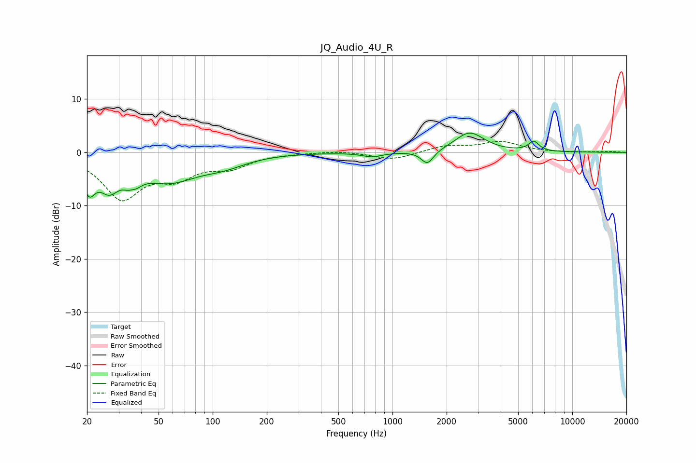

# JQ_Audio_4U_R
See [usage instructions](https://github.com/jaakkopasanen/AutoEq#usage) for more options and info.

### Parametric EQs
Apply preamp of -3.7 dB when using parametric equalizer.

|   # | Type    |   Fc (Hz) |    Q |   Gain (dB) |
|-----|---------|-----------|------|-------------|
|   1 | Peaking |        20 | 3.98 |        -5.5 |
|   2 | Peaking |        27 | 2.57 |        -4.8 |
|   3 | Peaking |        36 | 4.14 |        -5.7 |
|   4 | Peaking |        36 | 5.48 |         3.4 |
|   5 | Peaking |        57 | 0.88 |        -4.9 |
|   6 | Peaking |       116 | 1.11 |        -1.7 |
|   7 | Peaking |       769 | 2.49 |        -0.8 |
|   8 | Peaking |      1565 | 4.1  |        -2.6 |
|   9 | Peaking |      2687 | 1.75 |         3.7 |
|  10 | Peaking |      6104 | 4.77 |         1.8 |

### Fixed Band EQs
When using fixed band (also called graphic) equalizer, apply preamp of **-2.2 dB** (if available) and set gains manually with these parameters.

|   # | Type    |   Fc (Hz) |    Q |   Gain (dB) |
|-----|---------|-----------|------|-------------|
|   1 | Peaking |        31 | 1.41 |        -8.3 |
|   2 | Peaking |        62 | 1.41 |        -3.8 |
|   3 | Peaking |       125 | 1.41 |        -2.4 |
|   4 | Peaking |       250 | 1.41 |        -0.1 |
|   5 | Peaking |       500 | 1.41 |         0.3 |
|   6 | Peaking |      1000 | 1.41 |        -1.4 |
|   7 | Peaking |      2000 | 1.41 |         1.2 |
|   8 | Peaking |      4000 | 1.41 |         1.9 |
|   9 | Peaking |      8000 | 1.41 |        -0   |
|  10 | Peaking |     16000 | 1.41 |         0.2 |

### Graphs

