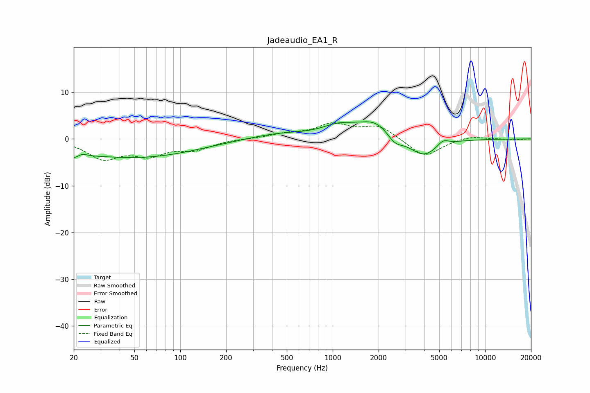

# Jadeaudio_EA1_R
See [usage instructions](https://github.com/jaakkopasanen/AutoEq#usage) for more options and info.

### Parametric EQs
Apply preamp of -3.8 dB when using parametric equalizer.

|   # | Type    |   Fc (Hz) |    Q |   Gain (dB) |
|-----|---------|-----------|------|-------------|
|   1 | Peaking |        21 | 2.24 |        -3.9 |
|   2 | Peaking |        22 | 3.04 |         2.9 |
|   3 | Peaking |        44 | 0.4  |        -3.4 |
|   4 | Peaking |       101 | 0.53 |        -0.9 |
|   5 | Peaking |       444 | 0.74 |         1.2 |
|   6 | Peaking |      1084 | 1.31 |         2   |
|   7 | Peaking |      1943 | 1.12 |         4   |
|   8 | Peaking |      2548 | 2.53 |        -2.5 |
|   9 | Peaking |      3942 | 1.45 |        -4.1 |
|  10 | Peaking |      5290 | 3.75 |         1.3 |

### Fixed Band EQs
When using fixed band (also called graphic) equalizer, apply preamp of **-3.6 dB** (if available) and set gains manually with these parameters.

|   # | Type    |   Fc (Hz) |    Q |   Gain (dB) |
|-----|---------|-----------|------|-------------|
|   1 | Peaking |        31 | 1.41 |        -4   |
|   2 | Peaking |        62 | 1.41 |        -3   |
|   3 | Peaking |       125 | 1.41 |        -2   |
|   4 | Peaking |       250 | 1.41 |         0.1 |
|   5 | Peaking |       500 | 1.41 |         0.9 |
|   6 | Peaking |      1000 | 1.41 |         2.9 |
|   7 | Peaking |      2000 | 1.41 |         2.8 |
|   8 | Peaking |      4000 | 1.41 |        -4   |
|   9 | Peaking |      8000 | 1.41 |         0.7 |
|  10 | Peaking |     16000 | 1.41 |        -0.2 |

### Graphs

