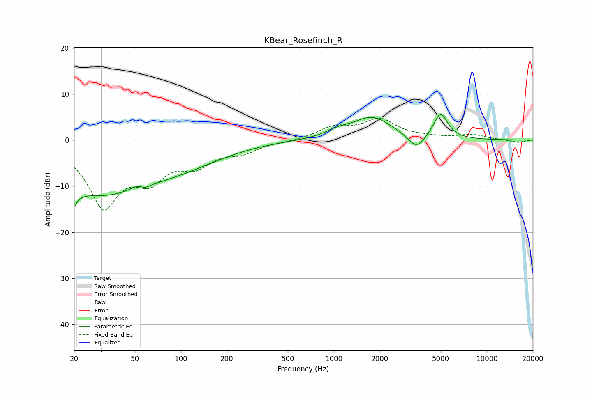

# KBear_Rosefinch_R
See [usage instructions](https://github.com/jaakkopasanen/AutoEq#usage) for more options and info.

### Parametric EQs
Apply preamp of -5.7 dB when using parametric equalizer.

|   # | Type    |   Fc (Hz) |    Q |   Gain (dB) |
|-----|---------|-----------|------|-------------|
|   1 | Peaking |        20 | 5.88 |       -12.3 |
|   2 | Peaking |        20 | 6    |         8.1 |
|   3 | Peaking |        30 | 0.4  |       -11   |
|   4 | Peaking |        52 | 3.12 |         0.9 |
|   5 | Peaking |        58 | 4.92 |        -0.7 |
|   6 | Peaking |       107 | 0.51 |        -3.1 |
|   7 | Peaking |      1054 | 1.87 |         1.1 |
|   8 | Peaking |      1779 | 1.09 |         4.9 |
|   9 | Peaking |      3471 | 2.62 |        -3.2 |
|  10 | Peaking |      4994 | 3.06 |         5.6 |

### Fixed Band EQs
When using fixed band (also called graphic) equalizer, apply preamp of **-4.8 dB** (if available) and set gains manually with these parameters.

|   # | Type    |   Fc (Hz) |    Q |   Gain (dB) |
|-----|---------|-----------|------|-------------|
|   1 | Peaking |        31 | 1.41 |       -13.8 |
|   2 | Peaking |        62 | 1.41 |        -6.5 |
|   3 | Peaking |       125 | 1.41 |        -4.5 |
|   4 | Peaking |       250 | 1.41 |        -2.2 |
|   5 | Peaking |       500 | 1.41 |        -0.2 |
|   6 | Peaking |      1000 | 1.41 |         2.6 |
|   7 | Peaking |      2000 | 1.41 |         4.2 |
|   8 | Peaking |      4000 | 1.41 |         0.4 |
|   9 | Peaking |      8000 | 1.41 |         1.1 |
|  10 | Peaking |     16000 | 1.41 |        -0.6 |

### Graphs

