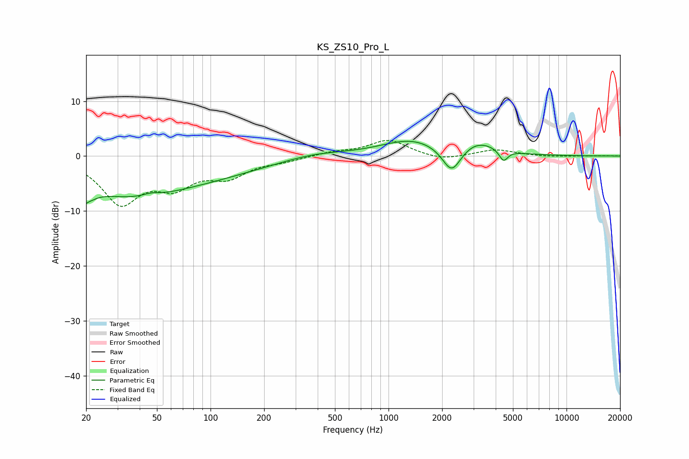

# KS_ZS10_Pro_L
See [usage instructions](https://github.com/jaakkopasanen/AutoEq#usage) for more options and info.

### Parametric EQs
Apply preamp of -2.8 dB when using parametric equalizer.

|   # | Type    |   Fc (Hz) |    Q |   Gain (dB) |
|-----|---------|-----------|------|-------------|
|   1 | Peaking |        20 | 4.17 |        -6.5 |
|   2 | Peaking |        20 | 5.39 |         3.5 |
|   3 | Peaking |        34 | 0.43 |        -6.7 |
|   4 | Peaking |        46 | 3.12 |         0.5 |
|   5 | Peaking |       118 | 0.46 |        -2   |
|   6 | Peaking |       381 | 0.81 |         0.9 |
|   7 | Peaking |      1344 | 0.83 |         2.9 |
|   8 | Peaking |      2264 | 2.68 |        -4.9 |
|   9 | Peaking |      3183 | 1.34 |         2.3 |
|  10 | Peaking |      4427 | 5.83 |        -2.1 |

### Fixed Band EQs
When using fixed band (also called graphic) equalizer, apply preamp of **-2.9 dB** (if available) and set gains manually with these parameters.

|   # | Type    |   Fc (Hz) |    Q |   Gain (dB) |
|-----|---------|-----------|------|-------------|
|   1 | Peaking |        31 | 1.41 |        -8.2 |
|   2 | Peaking |        62 | 1.41 |        -4.6 |
|   3 | Peaking |       125 | 1.41 |        -3.3 |
|   4 | Peaking |       250 | 1.41 |        -0.7 |
|   5 | Peaking |       500 | 1.41 |         0.7 |
|   6 | Peaking |      1000 | 1.41 |         2.9 |
|   7 | Peaking |      2000 | 1.41 |        -0.9 |
|   8 | Peaking |      4000 | 1.41 |         1.2 |
|   9 | Peaking |      8000 | 1.41 |        -0.1 |
|  10 | Peaking |     16000 | 1.41 |         0   |

### Graphs

