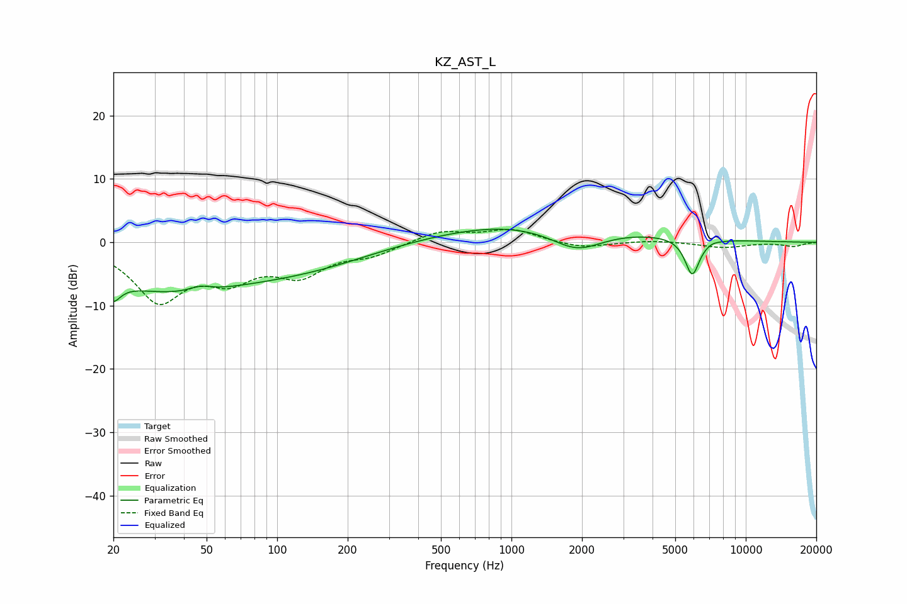

# KZ_AST_L
See [usage instructions](https://github.com/jaakkopasanen/AutoEq#usage) for more options and info.

### Parametric EQs
Apply preamp of -2.2 dB when using parametric equalizer.

|   # | Type    |   Fc (Hz) |    Q |   Gain (dB) |
|-----|---------|-----------|------|-------------|
|   1 | Peaking |        20 | 4.96 |        -6.7 |
|   2 | Peaking |        20 | 5.63 |         3.4 |
|   3 | Peaking |        34 | 0.41 |        -7.1 |
|   4 | Peaking |        47 | 3.03 |         0.8 |
|   5 | Peaking |       138 | 0.48 |        -3.1 |
|   6 | Peaking |       954 | 0.65 |         0.8 |
|   7 | Peaking |      1350 | 0.25 |         2.4 |
|   8 | Peaking |      1903 | 1.26 |        -3.5 |
|   9 | Peaking |      5909 | 4.43 |        -5.9 |
|  10 | Peaking |      7203 | 5.98 |         0.2 |

### Fixed Band EQs
When using fixed band (also called graphic) equalizer, apply preamp of **-2.1 dB** (if available) and set gains manually with these parameters.

|   # | Type    |   Fc (Hz) |    Q |   Gain (dB) |
|-----|---------|-----------|------|-------------|
|   1 | Peaking |        31 | 1.41 |        -8.8 |
|   2 | Peaking |        62 | 1.41 |        -4.7 |
|   3 | Peaking |       125 | 1.41 |        -4.5 |
|   4 | Peaking |       250 | 1.41 |        -1.7 |
|   5 | Peaking |       500 | 1.41 |         1.8 |
|   6 | Peaking |      1000 | 1.41 |         2   |
|   7 | Peaking |      2000 | 1.41 |        -1   |
|   8 | Peaking |      4000 | 1.41 |         0.3 |
|   9 | Peaking |      8000 | 1.41 |        -0.8 |
|  10 | Peaking |     16000 | 1.41 |        -0.6 |

### Graphs

