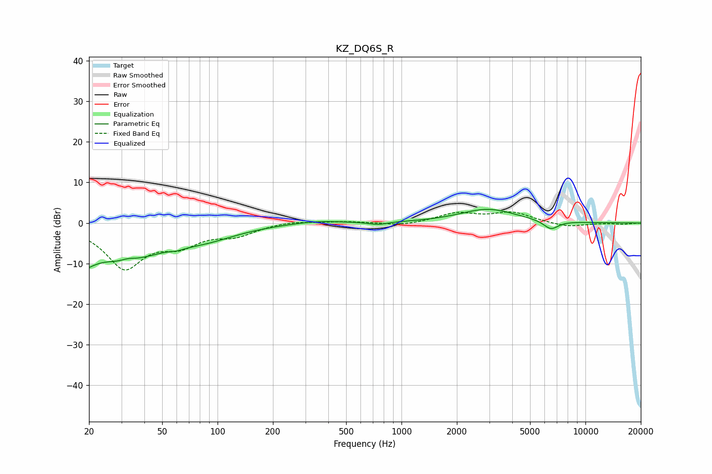

# KZ_DQ6S_R
See [usage instructions](https://github.com/jaakkopasanen/AutoEq#usage) for more options and info.

### Parametric EQs
Apply preamp of -3.4 dB when using parametric equalizer.

|   # | Type    |   Fc (Hz) |    Q |   Gain (dB) |
|-----|---------|-----------|------|-------------|
|   1 | Peaking |        20 | 4.11 |        -7.7 |
|   2 | Peaking |        20 | 5.5  |         3.5 |
|   3 | Peaking |        30 | 0.68 |        -8.7 |
|   4 | Peaking |        33 | 3.29 |         0.9 |
|   5 | Peaking |        60 | 4.41 |        -0.4 |
|   6 | Peaking |        84 | 0.77 |        -2.9 |
|   7 | Peaking |       345 | 1.03 |         0.7 |
|   8 | Peaking |       743 | 2.89 |        -0.7 |
|   9 | Peaking |      2946 | 0.92 |         3.4 |
|  10 | Peaking |      6489 | 3.36 |        -2.2 |

### Fixed Band EQs
When using fixed band (also called graphic) equalizer, apply preamp of **-2.8 dB** (if available) and set gains manually with these parameters.

|   # | Type    |   Fc (Hz) |    Q |   Gain (dB) |
|-----|---------|-----------|------|-------------|
|   1 | Peaking |        31 | 1.41 |       -10.7 |
|   2 | Peaking |        62 | 1.41 |        -4.2 |
|   3 | Peaking |       125 | 1.41 |        -2.6 |
|   4 | Peaking |       250 | 1.41 |         0.6 |
|   5 | Peaking |       500 | 1.41 |         0.4 |
|   6 | Peaking |      1000 | 1.41 |        -0.7 |
|   7 | Peaking |      2000 | 1.41 |         2.3 |
|   8 | Peaking |      4000 | 1.41 |         2.5 |
|   9 | Peaking |      8000 | 1.41 |        -1   |
|  10 | Peaking |     16000 | 1.41 |        -0.3 |

### Graphs

