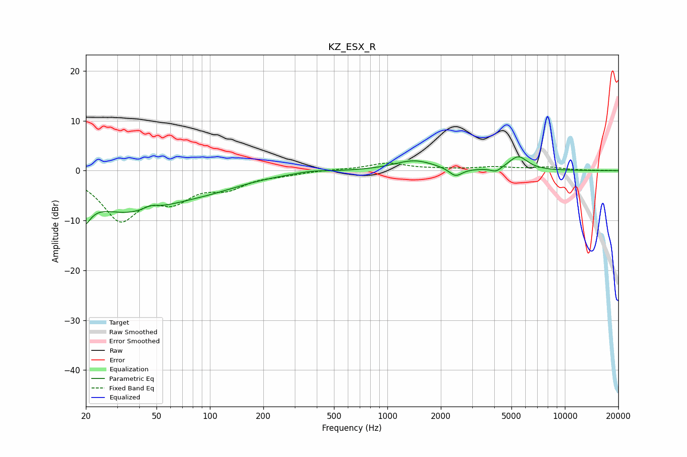

# KZ_ESX_R
See [usage instructions](https://github.com/jaakkopasanen/AutoEq#usage) for more options and info.

### Parametric EQs
Apply preamp of -2.9 dB when using parametric equalizer.

|   # | Type    |   Fc (Hz) |    Q |   Gain (dB) |
|-----|---------|-----------|------|-------------|
|   1 | Peaking |        20 | 4.75 |        -8.1 |
|   2 | Peaking |        20 | 5.69 |         3.4 |
|   3 | Peaking |        34 | 0.51 |        -7.8 |
|   4 | Peaking |        46 | 3.32 |         0.9 |
|   5 | Peaking |       103 | 0.65 |        -1.9 |
|   6 | Peaking |       374 | 1.81 |         0.4 |
|   7 | Peaking |      1417 | 1.25 |         2.1 |
|   8 | Peaking |      2422 | 3.92 |        -1.7 |
|   9 | Peaking |      4103 | 4.95 |        -0.9 |
|  10 | Peaking |      5458 | 2.63 |         2.8 |

### Fixed Band EQs
When using fixed band (also called graphic) equalizer, apply preamp of **-1.6 dB** (if available) and set gains manually with these parameters.

|   # | Type    |   Fc (Hz) |    Q |   Gain (dB) |
|-----|---------|-----------|------|-------------|
|   1 | Peaking |        31 | 1.41 |        -9.3 |
|   2 | Peaking |        62 | 1.41 |        -4.7 |
|   3 | Peaking |       125 | 1.41 |        -2.9 |
|   4 | Peaking |       250 | 1.41 |        -0.6 |
|   5 | Peaking |       500 | 1.41 |         0.2 |
|   6 | Peaking |      1000 | 1.41 |         1.5 |
|   7 | Peaking |      2000 | 1.41 |         0.2 |
|   8 | Peaking |      4000 | 1.41 |         0.6 |
|   9 | Peaking |      8000 | 1.41 |         0.6 |
|  10 | Peaking |     16000 | 1.41 |         0   |

### Graphs

