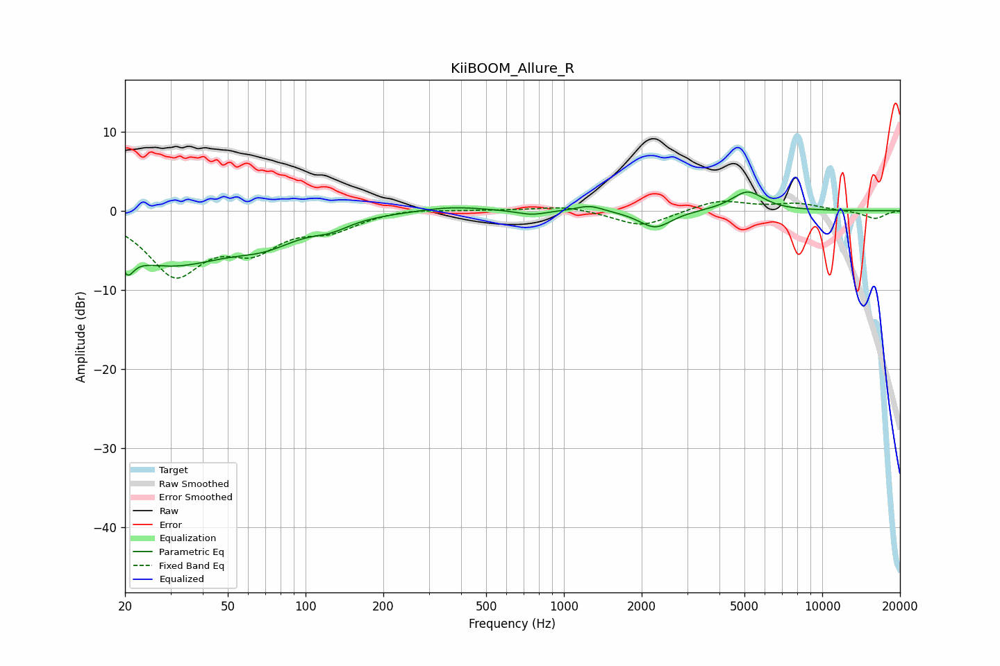

# KiiBOOM_Allure_R
See [usage instructions](https://github.com/jaakkopasanen/AutoEq#usage) for more options and info.

### Parametric EQs
Apply preamp of -2.5 dB when using parametric equalizer.

|   # | Type    |   Fc (Hz) |    Q |   Gain (dB) |
|-----|---------|-----------|------|-------------|
|   1 | Peaking |        20 | 5.01 |         3.8 |
|   2 | Peaking |        20 | 5.29 |        -6.5 |
|   3 | Peaking |        30 | 0.59 |        -6.5 |
|   4 | Peaking |        70 | 1.14 |        -2.2 |
|   5 | Peaking |       125 | 1.95 |        -1.1 |
|   6 | Peaking |       370 | 1.16 |         0.6 |
|   7 | Peaking |       750 | 2.53 |        -0.6 |
|   8 | Peaking |      1256 | 2.73 |         0.8 |
|   9 | Peaking |      2256 | 2.27 |        -2.2 |
|  10 | Peaking |      5139 | 2.21 |         2.5 |

### Fixed Band EQs
When using fixed band (also called graphic) equalizer, apply preamp of **-1.3 dB** (if available) and set gains manually with these parameters.

|   # | Type    |   Fc (Hz) |    Q |   Gain (dB) |
|-----|---------|-----------|------|-------------|
|   1 | Peaking |        31 | 1.41 |        -7.7 |
|   2 | Peaking |        62 | 1.41 |        -4.1 |
|   3 | Peaking |       125 | 1.41 |        -2   |
|   4 | Peaking |       250 | 1.41 |         0.4 |
|   5 | Peaking |       500 | 1.41 |         0.1 |
|   6 | Peaking |      1000 | 1.41 |         0.7 |
|   7 | Peaking |      2000 | 1.41 |        -2   |
|   8 | Peaking |      4000 | 1.41 |         1.4 |
|   9 | Peaking |      8000 | 1.41 |         0.9 |
|  10 | Peaking |     16000 | 1.41 |        -1   |

### Graphs

