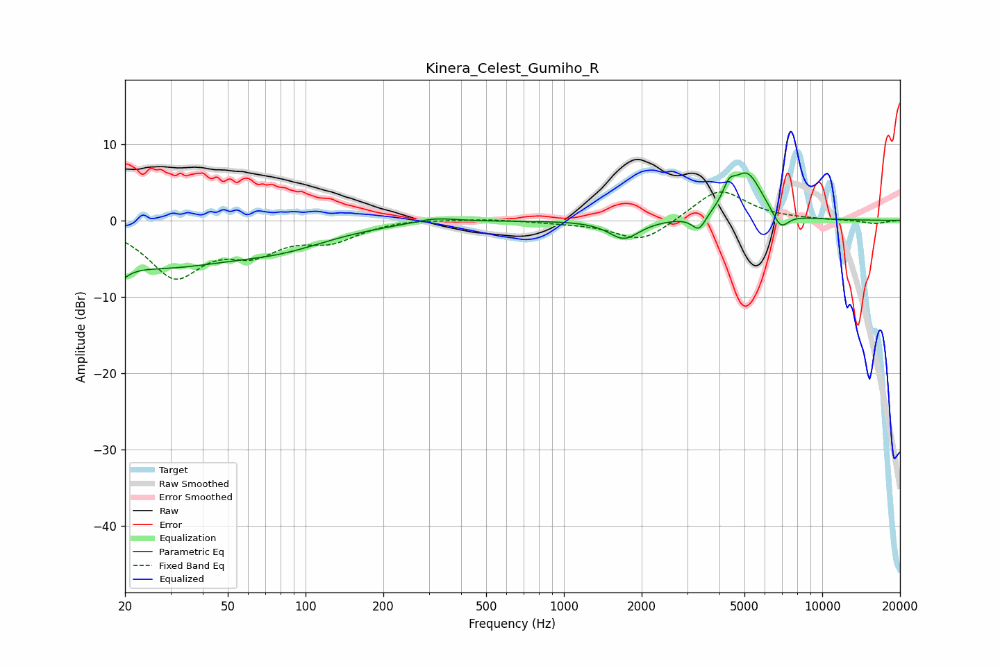

# Kinera_Celest_Gumiho_R
See [usage instructions](https://github.com/jaakkopasanen/AutoEq#usage) for more options and info.

### Parametric EQs
Apply preamp of -6.3 dB when using parametric equalizer.

|   # | Type    |   Fc (Hz) |    Q |   Gain (dB) |
|-----|---------|-----------|------|-------------|
|   1 | Peaking |        20 | 5.1  |        -5.1 |
|   2 | Peaking |        20 | 5.56 |         3.4 |
|   3 | Peaking |        26 | 0.43 |        -5.7 |
|   4 | Peaking |        83 | 0.73 |        -2.1 |
|   5 | Peaking |       319 | 1.77 |         0.7 |
|   6 | Peaking |      1710 | 2.42 |        -2.5 |
|   7 | Peaking |      3332 | 5.32 |        -2   |
|   8 | Peaking |      4357 | 5.68 |         2.2 |
|   9 | Peaking |      5120 | 2.32 |         6.1 |
|  10 | Peaking |      6900 | 4.38 |        -2.3 |

### Fixed Band EQs
When using fixed band (also called graphic) equalizer, apply preamp of **-3.8 dB** (if available) and set gains manually with these parameters.

|   # | Type    |   Fc (Hz) |    Q |   Gain (dB) |
|-----|---------|-----------|------|-------------|
|   1 | Peaking |        31 | 1.41 |        -7   |
|   2 | Peaking |        62 | 1.41 |        -3.4 |
|   3 | Peaking |       125 | 1.41 |        -2.3 |
|   4 | Peaking |       250 | 1.41 |         0.3 |
|   5 | Peaking |       500 | 1.41 |         0.2 |
|   6 | Peaking |      1000 | 1.41 |        -0.2 |
|   7 | Peaking |      2000 | 1.41 |        -2.9 |
|   8 | Peaking |      4000 | 1.41 |         4.2 |
|   9 | Peaking |      8000 | 1.41 |         0.1 |
|  10 | Peaking |     16000 | 1.41 |        -0.5 |

### Graphs

