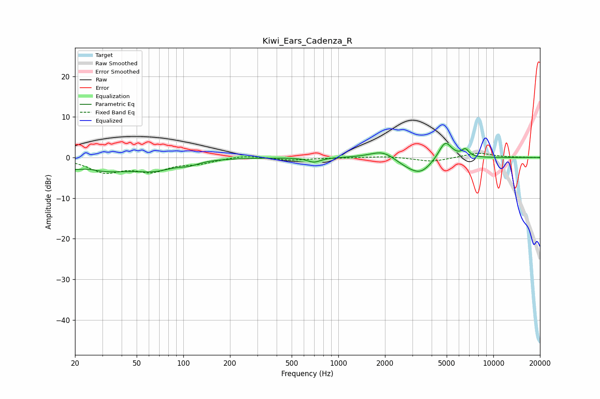

# Kiwi_Ears_Cadenza_R
See [usage instructions](https://github.com/jaakkopasanen/AutoEq#usage) for more options and info.

### Parametric EQs
Apply preamp of -3.6 dB when using parametric equalizer.

|   # | Type    |   Fc (Hz) |    Q |   Gain (dB) |
|-----|---------|-----------|------|-------------|
|   1 | Peaking |        24 | 2    |         1.1 |
|   2 | Peaking |        25 | 0.57 |        -3.8 |
|   3 | Peaking |        66 | 1.21 |        -1.9 |
|   4 | Peaking |       109 | 2.31 |        -0.9 |
|   5 | Peaking |       697 | 3.31 |        -1.1 |
|   6 | Peaking |      1949 | 1.71 |         2.1 |
|   7 | Peaking |      2666 | 1.67 |        -1.3 |
|   8 | Peaking |      3390 | 1.84 |        -3.6 |
|   9 | Peaking |      4890 | 3.26 |         4.6 |
|  10 | Peaking |      6599 | 5.75 |         1.8 |

### Fixed Band EQs
When using fixed band (also called graphic) equalizer, apply preamp of **-1.1 dB** (if available) and set gains manually with these parameters.

|   # | Type    |   Fc (Hz) |    Q |   Gain (dB) |
|-----|---------|-----------|------|-------------|
|   1 | Peaking |        31 | 1.41 |        -3.3 |
|   2 | Peaking |        62 | 1.41 |        -3   |
|   3 | Peaking |       125 | 1.41 |        -1.2 |
|   4 | Peaking |       250 | 1.41 |         0.6 |
|   5 | Peaking |       500 | 1.41 |        -0.6 |
|   6 | Peaking |      1000 | 1.41 |        -0.1 |
|   7 | Peaking |      2000 | 1.41 |         0.3 |
|   8 | Peaking |      4000 | 1.41 |        -1.1 |
|   9 | Peaking |      8000 | 1.41 |         1.2 |
|  10 | Peaking |     16000 | 1.41 |         0   |

### Graphs

