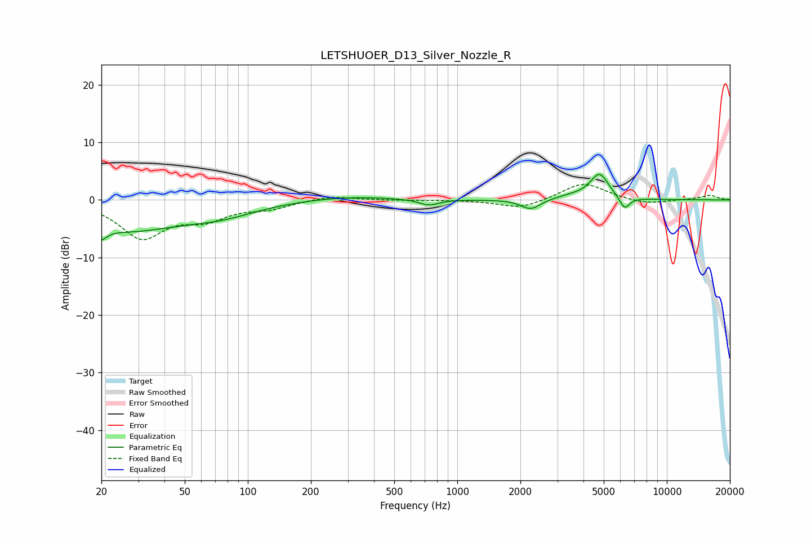

# LETSHUOER_D13_Silver_Nozzle_R
See [usage instructions](https://github.com/jaakkopasanen/AutoEq#usage) for more options and info.

### Parametric EQs
Apply preamp of -4.5 dB when using parametric equalizer.

|   # | Type    |   Fc (Hz) |    Q |   Gain (dB) |
|-----|---------|-----------|------|-------------|
|   1 | Peaking |        20 | 5.42 |        -5.5 |
|   2 | Peaking |        20 | 5.51 |         3.5 |
|   3 | Peaking |        26 | 0.51 |        -5.1 |
|   4 | Peaking |        76 | 0.85 |        -1.7 |
|   5 | Peaking |       298 | 0.68 |         0.7 |
|   6 | Peaking |       731 | 3    |        -1   |
|   7 | Peaking |      2240 | 3.04 |        -1.8 |
|   8 | Peaking |      3540 | 1.68 |         0.6 |
|   9 | Peaking |      4769 | 3.18 |         4.4 |
|  10 | Peaking |      6286 | 5.64 |        -2.2 |

### Fixed Band EQs
When using fixed band (also called graphic) equalizer, apply preamp of **-2.8 dB** (if available) and set gains manually with these parameters.

|   # | Type    |   Fc (Hz) |    Q |   Gain (dB) |
|-----|---------|-----------|------|-------------|
|   1 | Peaking |        31 | 1.41 |        -6.3 |
|   2 | Peaking |        62 | 1.41 |        -2.8 |
|   3 | Peaking |       125 | 1.41 |        -1.2 |
|   4 | Peaking |       250 | 1.41 |         0.8 |
|   5 | Peaking |       500 | 1.41 |        -0.1 |
|   6 | Peaking |      1000 | 1.41 |         0   |
|   7 | Peaking |      2000 | 1.41 |        -1.6 |
|   8 | Peaking |      4000 | 1.41 |         3.1 |
|   9 | Peaking |      8000 | 1.41 |        -0.8 |
|  10 | Peaking |     16000 | 1.41 |         0.8 |

### Graphs

