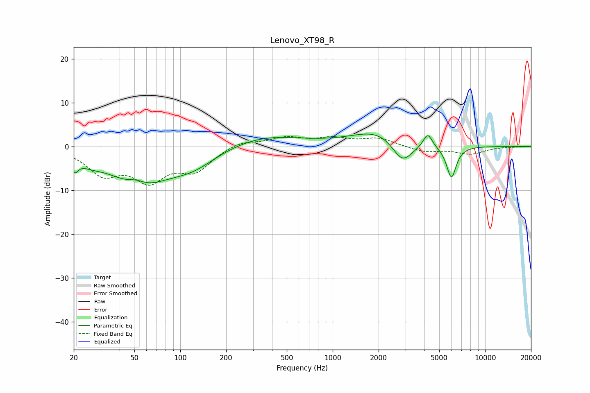

# Lenovo_XT98_R
See [usage instructions](https://github.com/jaakkopasanen/AutoEq#usage) for more options and info.

### Parametric EQs
Apply preamp of -2.9 dB when using parametric equalizer.

|   # | Type    |   Fc (Hz) |    Q |   Gain (dB) |
|-----|---------|-----------|------|-------------|
|   1 | Peaking |        20 | 5.87 |        -2.8 |
|   2 | Peaking |        26 | 2.02 |        -1.1 |
|   3 | Peaking |        51 | 2.58 |         1.3 |
|   4 | Peaking |        54 | 0.67 |        -8.4 |
|   5 | Peaking |       123 | 0.94 |        -3.1 |
|   6 | Peaking |       353 | 0.57 |         2.6 |
|   7 | Peaking |      2058 | 0.81 |         4   |
|   8 | Peaking |      2863 | 1.98 |        -5.8 |
|   9 | Peaking |      4203 | 4.78 |         3.2 |
|  10 | Peaking |      6007 | 4.31 |        -7.4 |

### Fixed Band EQs
When using fixed band (also called graphic) equalizer, apply preamp of **-2.4 dB** (if available) and set gains manually with these parameters.

|   # | Type    |   Fc (Hz) |    Q |   Gain (dB) |
|-----|---------|-----------|------|-------------|
|   1 | Peaking |        31 | 1.41 |        -5.7 |
|   2 | Peaking |        62 | 1.41 |        -6.9 |
|   3 | Peaking |       125 | 1.41 |        -5   |
|   4 | Peaking |       250 | 1.41 |         1.4 |
|   5 | Peaking |       500 | 1.41 |         1.9 |
|   6 | Peaking |      1000 | 1.41 |         1.6 |
|   7 | Peaking |      2000 | 1.41 |         1.8 |
|   8 | Peaking |      4000 | 1.41 |        -1.2 |
|   9 | Peaking |      8000 | 1.41 |        -1.7 |
|  10 | Peaking |     16000 | 1.41 |        -0.1 |

### Graphs

