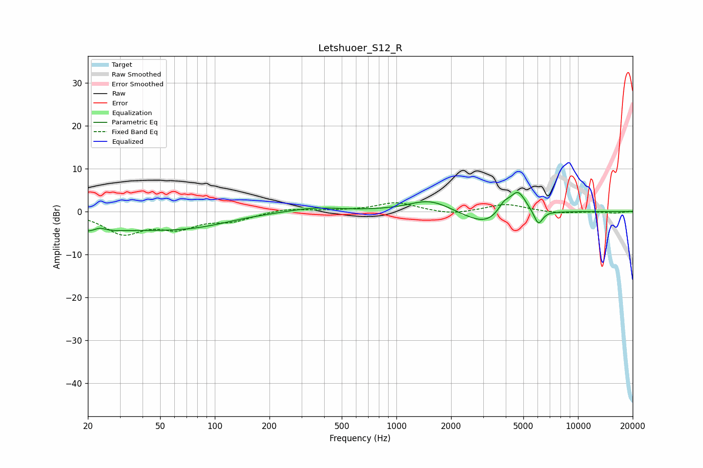

# Letshuoer_S12_R
See [usage instructions](https://github.com/jaakkopasanen/AutoEq#usage) for more options and info.

### Parametric EQs
Apply preamp of -4.5 dB when using parametric equalizer.

|   # | Type    |   Fc (Hz) |    Q |   Gain (dB) |
|-----|---------|-----------|------|-------------|
|   1 | Peaking |        22 | 1.72 |        -4.3 |
|   2 | Peaking |        23 | 3.11 |         2.7 |
|   3 | Peaking |        46 | 0.48 |        -3.6 |
|   4 | Peaking |        87 | 0.84 |        -1   |
|   5 | Peaking |       352 | 1.01 |         1   |
|   6 | Peaking |      1529 | 1.21 |         2.9 |
|   7 | Peaking |      3119 | 1.17 |        -3.5 |
|   8 | Peaking |      3909 | 3.96 |         2.5 |
|   9 | Peaking |      4666 | 3.06 |         5.4 |
|  10 | Peaking |      6046 | 5.68 |        -3.4 |

### Fixed Band EQs
When using fixed band (also called graphic) equalizer, apply preamp of **-2.1 dB** (if available) and set gains manually with these parameters.

|   # | Type    |   Fc (Hz) |    Q |   Gain (dB) |
|-----|---------|-----------|------|-------------|
|   1 | Peaking |        31 | 1.41 |        -4.9 |
|   2 | Peaking |        62 | 1.41 |        -3.4 |
|   3 | Peaking |       125 | 1.41 |        -1.9 |
|   4 | Peaking |       250 | 1.41 |         0.8 |
|   5 | Peaking |       500 | 1.41 |         0.1 |
|   6 | Peaking |      1000 | 1.41 |         2.1 |
|   7 | Peaking |      2000 | 1.41 |        -0.8 |
|   8 | Peaking |      4000 | 1.41 |         1.7 |
|   9 | Peaking |      8000 | 1.41 |        -0.5 |
|  10 | Peaking |     16000 | 1.41 |        -0.4 |

### Graphs

