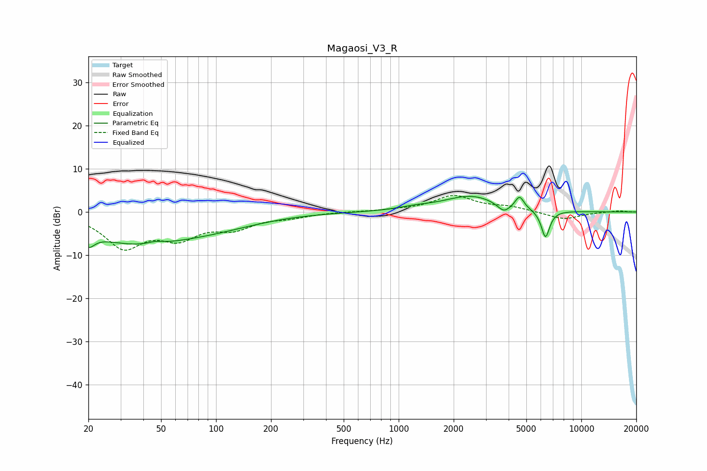

# Magaosi_V3_R
See [usage instructions](https://github.com/jaakkopasanen/AutoEq#usage) for more options and info.

### Parametric EQs
Apply preamp of -3.7 dB when using parametric equalizer.

|   # | Type    |   Fc (Hz) |    Q |   Gain (dB) |
|-----|---------|-----------|------|-------------|
|   1 | Peaking |        20 | 5.19 |        -7.3 |
|   2 | Peaking |        20 | 5.99 |         4.1 |
|   3 | Peaking |        36 | 0.49 |        -6.7 |
|   4 | Peaking |        47 | 3.32 |         0.6 |
|   5 | Peaking |       102 | 0.56 |        -2.3 |
|   6 | Peaking |      1228 | 1.55 |         0.6 |
|   7 | Peaking |      2490 | 0.94 |         3.7 |
|   8 | Peaking |      3763 | 4.03 |        -2   |
|   9 | Peaking |      4591 | 5.88 |         2.9 |
|  10 | Peaking |      6365 | 5.86 |        -6.4 |

### Fixed Band EQs
When using fixed band (also called graphic) equalizer, apply preamp of **-3.9 dB** (if available) and set gains manually with these parameters.

|   # | Type    |   Fc (Hz) |    Q |   Gain (dB) |
|-----|---------|-----------|------|-------------|
|   1 | Peaking |        31 | 1.41 |        -7.8 |
|   2 | Peaking |        62 | 1.41 |        -5.1 |
|   3 | Peaking |       125 | 1.41 |        -3.2 |
|   4 | Peaking |       250 | 1.41 |        -1   |
|   5 | Peaking |       500 | 1.41 |         0.1 |
|   6 | Peaking |      1000 | 1.41 |         0.3 |
|   7 | Peaking |      2000 | 1.41 |         3.7 |
|   8 | Peaking |      4000 | 1.41 |         1   |
|   9 | Peaking |      8000 | 1.41 |        -1.7 |
|  10 | Peaking |     16000 | 1.41 |         0.3 |

### Graphs

